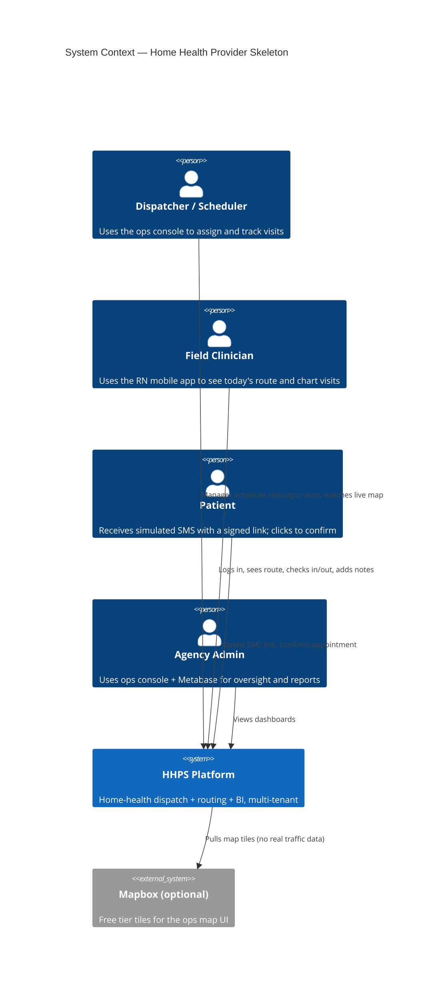
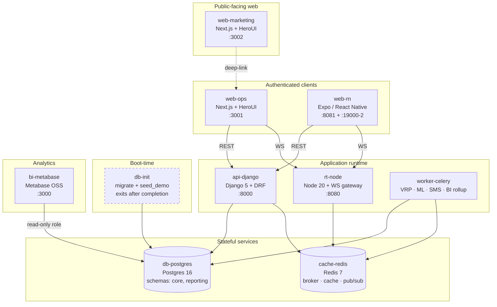
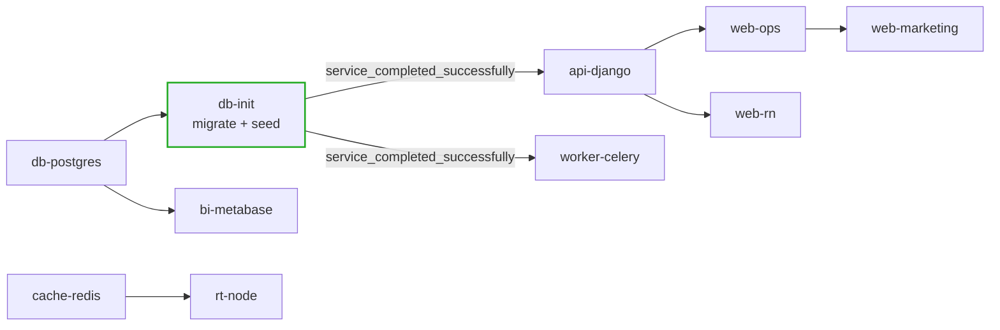
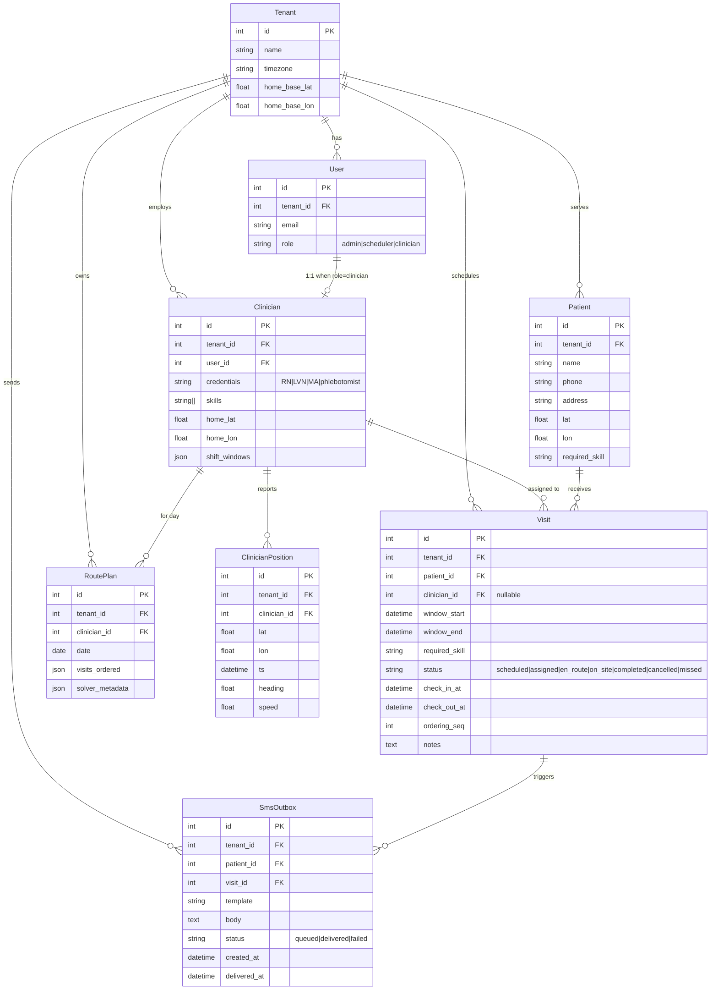
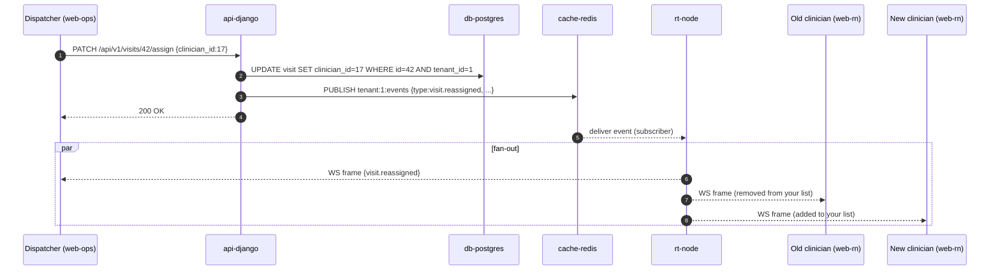
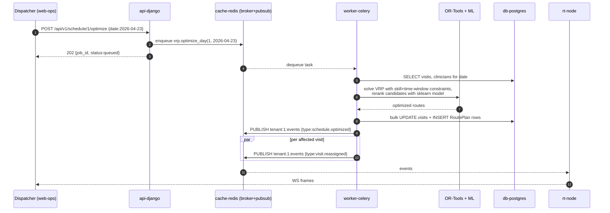
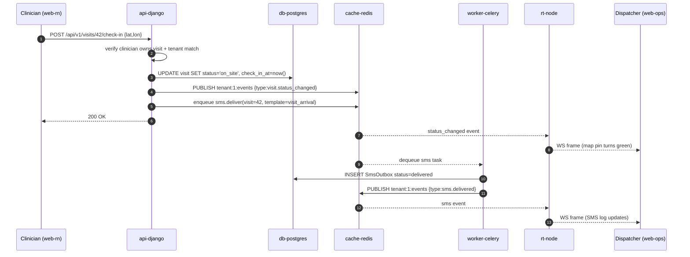

# Home Health Provider Skeleton — Architecture

> **Status:** Living document.
> - Scoped 2026-04-23.
> - Phase 1 (Foundations) delivered 2026-04-23 — bootable compose, JWT auth, tenancy middleware, seed.
> - Phase 2 (Core Domain) delivered 2026-04-24 — eight domain models, tenant-scoped REST API, Visit state machine. 73 tests, lint/type/CI all green.
> - Phase 3 (Routing & ML) delivered 2026-04-24 — OR-Tools VRP adapter + solver, sklearn GradientBoostingRegressor re-ranker, Celery `optimize_day` task, `POST /schedule/<date>/optimize` endpoint, Phase 3 seed scale (25 clinicians × 300 patients × 80 today-visits × 90 days of history per tenant). 103 tests.
> - Phase 4 (Real-time) delivered 2026-04-24 — `core.events.publish()` + tenant-scoped Redis channels, every Phase 3 write path emits events, `POST /auth/ws-token` mints 60s JWTs with `scope="ws"`, `apps/rt-node/` TypeScript gateway (`:8080`) authenticates WS clients and fans messages out, application-level heartbeats, end-to-end smoke test in `ops/ws-smoke.sh`. 196+ tests across Python + Node, 96%+ coverage on both sides.
> - Phase 5 (Ops web console) delivered 2026-04-24 — `apps/web-ops/` Next.js 16 + React 19 + HeroUI 3 + Tailwind 4 SPA on `:3001`. JWT login + route guard, today board with status filter + Optimize Day, click-to-reassign modal with optimistic mutation + 409 rollback, SVG live ops map driven by `clinician.position_updated`, and read-only clinicians / patients / sms pages. 56 vitest cases on the React side; 220+ tests stackwide.
> - Phase 6 (Clinician view) delivered 2026-04-24 — same `apps/web-ops/` SPA gains a `/clinician` route the role-aware `(authed)` layout redirects to. Today's route in `ordering_seq` order with check-in / check-out optimistic mutations, a GPS pinger that POSTs `/positions/`, and a `seed_demo --enable-clinician-login` flag that flips `c00@<slug>.demo` to a usable demo password so the dispatcher↔clinician loop can be exercised end-to-end. Native Expo Build deferred to a follow-up. 240+ tests stackwide.
> - Phase 7 (Marketing site) delivered 2026-04-24 — `apps/web-marketing/` Next.js 16 + HeroUI 3 single-page brand site on `:3002`. Hero + features + pricing tier + inert contact form + "Open the demo" deep-link to `:3001`. Statically prerendered.
> - Phase 8 (BI pipeline) is next.
> **Subject:** A portfolio-scale clone of a B2B home-health dispatching platform, built to actually work end-to-end.
> **Repo:** `home-health-provider-skeleton`

---

## 1. Goal & Scope

**Goal.** Build a working, end-to-end home-health dispatching platform as a learning / portfolio project. It must run locally and actually function — real scheduling logic, real event flow, real multi-tenant isolation — without the weight of production operations (no cloud, no PHI, no real integrations).

**Modeled after.** A B2B SaaS platform for home-health agencies. Our clone mirrors the *shape* of that product category: a clinician field app, an ops/dispatch console, and patient engagement, with an AI-driven routing brain underneath.

**Non-goals.**
- Not a production system. No HIPAA audit, no SOC 2, no BAA, no real PHI.
- Not an EHR. No clinical documentation depth (OASIS, med-rec, etc.).
- Not a cloud deployment. Local `docker-compose` only.
- Not offline-capable. Online-only on the mobile app.
- Not a real integrations story. SMS, maps, and EMR are all simulated.

---

## 2. Scoping Decisions

Every decision below was made explicitly during scoping. These are load-bearing — changes to any of them ripple through the rest of the document.

| # | Decision | Choice | Rationale |
|---|---|---|---|
| 1 | Build goal | Learning / portfolio — must work end-to-end | Review-friendly, low cost, high signal |
| 2 | Product surface | All three surfaces (clinician app, ops console, patient SMS), shallow but connected end-to-end | Demonstrates the full dispatch loop in one demo |
| 3 | Routing brain | Google OR-Tools VRP solver + ML re-ranker on top | Mirrors the category's technical moat; showcases OR + ML competency |
| 4 | Tenancy | Row-level multi-tenant (`tenant_id` on every domain row, middleware-scoped queries) | Industry standard B2B SaaS pattern; minimal overhead |
| 5 | SMS / patient engagement | Simulated — messages written to a `sms_outbox` table, rendered in ops console | Zero cost, fully demo-able, no Twilio account needed |
| 6 | Routing / travel-time | Haversine distance + fixed average speed (40 mph) | Cheapest option; known limitation: routes won't follow roads on the map |
| 7 | EMR integration | Mock FHIR-adjacent JSON seed data only — no real FHIR server, no Epic sandbox | Scope control |
| 8 | Real-time layer | Node+TS WebSocket gateway subscribing to Redis pub/sub; Django publishes events | Keeps business logic in Django; Node stays ~500 lines |
| 9 | Auth | JWT + email/password; `role` field on `User` (`clinician`, `scheduler`, `admin`); patients authenticate via signed one-time SMS link | Fastest path that works; no SSO, no RBAC matrix |
| 10 | Offline support | None — online-only | Offline sync is a whole discipline; deferred |
| 11 | BI / analytics | Embedded Metabase pointed at a `reporting` Postgres schema | Industry-standard BI tool; showcases OLTP/OLAP understanding |
| 12 | BI pipeline | Nightly Django management command aggregates OLTP → `reporting` schema | Clean OLTP/OLAP separation without a full dbt/warehouse |
| 13 | Deployment | Local `docker-compose` only, README with demo video | No cloud cost, no infra yak-shaving |
| 14 | Clinical data depth | Operational-only (patient, address, window, skill, status, timestamps, free-text notes) | This is a logistics platform, not an EHR |
| 15 | Seed world size | 2 agencies × 25 clinicians × 300 patients × ~80 visits/day, LA Basin real street addresses | Enough scale for VRP/ML to do real work; small enough to reason about |
| 16 | Web UI kit | **HeroUI** (Tailwind-native React component library, NextUI successor) across all web surfaces | Unified look & feel across ops + marketing; modern, accessible, good defaults |
| 17 | Marketing site | Separate Next.js app (`web-marketing`) using HeroUI — hero, features, pricing, contact | Mirrors a typical B2B SaaS brand site; demonstrates brand-facing UI chops in addition to operational UI |
| 18 | Single `docker compose up` covers everything | Yes — including the Expo dev server for the RN app | One command boots the entire platform |
| 19 | Default demo logins | Seeded admin/scheduler/clinician accounts per tenant, all with `demo1234` password | Instant demo-ability without a registration flow |
| 20 | Seed-on-startup | Dedicated one-shot `db-init` compose service runs migrations + idempotent seed before API starts | Deterministic, reproducible demos from a cold boot |

---

## 3. Stack

| Layer | Technology | Why |
|---|---|---|
| Mobile (clinician) | React Native via **Expo (SDK 52+)**, TypeScript | Cross-platform from one codebase; Expo Go = instant demo; RN was user-chosen. Runs inside compose via its own container, exposing Metro + Expo dev ports to the host |
| Ops web console | **Next.js 14 (App Router)** + React + TypeScript + **HeroUI** + Tailwind | Clean SPA; HeroUI brings a consistent, accessible component system (tables, drag-and-drop, dark mode) across all web surfaces |
| Marketing / landing site | **Next.js 14** + React + TypeScript + **HeroUI** + Tailwind | Separate app at `:3002` mirroring a B2B SaaS brand site — hero, features, pricing, contact form; "Book demo" CTA deep-links to the ops console |
| Map on ops console | **Mapbox GL JS** (free tier) with simulated travel times | Map is visually central to the demo; free tier is enough |
| Backend API | **Django 5** + **Django REST Framework** + Python 3.12 | Django was user-chosen; DRF is the canonical REST layer |
| Async / background work | **Celery** (worker shares Django codebase) + **Redis** broker | Hosts VRP solves, ML scoring, nightly BI rollup, simulated SMS side-effects |
| Routing solver | **Google OR-Tools** (Python), invoked from a Celery task | The industry default for VRP with time windows and constraints |
| ML re-ranker | **scikit-learn** (Gradient Boosted Trees, initially), pickled to disk, loaded in Celery worker | Keep it simple; no GPU, no model server |
| Real-time gateway | **Node 20 + TypeScript + `ws` + `ioredis`** | Thin pub/sub fanout; no Express needed |
| Primary DB | **Postgres 16** (single instance, two schemas: `core`, `reporting`) | Industry default; supports row-level tenancy with ease |
| Cache / queue / pub-sub | **Redis 7** | Celery broker, Django cache, Node WS pub/sub — one component, three roles |
| BI | **Metabase** OSS (Docker image) | Free, mature, embeddable, good enough dashboards out of the box |
| Orchestration (dev) | **Docker Compose** | Single `docker compose up` to boot the whole stack |
| CI | **GitHub Actions** — lint, test, typecheck on PRs | Portfolio signal; minimal cost |

---

## 4. Service Topology

All services run under `docker-compose` on a single developer machine. **`docker compose up` boots the entire platform** — API, worker, real-time gateway, ops console, marketing site, Expo dev server, Metabase, and a one-shot seed step.

### 4.1 System Context (C4 Level 1)

Who uses the system and what external services are involved.



### 4.2 Service Topology (C4 Level 2 / Container)

Every rectangle is a container in `docker-compose.yml`.



### 4.3 Boot Order

`docker compose up` sequences services so downstream ones only start after their dependencies are ready.



Downstream services declare `depends_on: db-init: condition: service_completed_successfully` so the API only starts after the database is migrated and seeded.

---

## 5. Services in Detail

### 5.1 `api-django` — Django 5 + DRF
System of record. Owns authentication, domain models, business logic, and EMR mock endpoints. Publishes domain events to Redis on state changes. Single codebase shared with the Celery worker.

**Responsibilities**
- REST API for ops console and clinician app (`/api/v1/...`)
- Public patient endpoints (signed-URL, no auth) for SMS-link confirmations and ETA pages
- Authentication: JWT issuance (access + refresh), short-lived WS-auth token minting
- Multi-tenant middleware: parses `tenant_id` from JWT claim and scopes every ORM query via a `TenantScopedManager`
- Event publisher: any state change that needs real-time fanout emits a JSON message to a Redis channel (`tenant:{id}:events`)
- Mock FHIR / EMR endpoints serving seeded JSON (Patient, Encounter, Practitioner, Location)

### 5.2 `worker-celery` — Celery worker
Same codebase as `api-django`. Dedicated worker process(es).

**Key tasks**
- `vrp.optimize_day(tenant_id, date)` — runs OR-Tools on the day's visit pool and clinician pool for a given tenant, writes the result to the DB, publishes `schedule.optimized`
- `ml.rerank_candidates(visit_id)` — scores candidate clinician assignments with the pickled sklearn model; used as a scoring hook inside the VRP's objective function
- `sms.deliver(sms_id)` — simulated SMS: writes to `sms_outbox` with `status='delivered'`, publishes `sms.delivered` to the ops UI
- `reporting.rollup_daily(date)` — aggregates `core.*` into `reporting.*` tables; scheduled via Celery Beat at 02:00 local
- `geo.update_clinician_position(clinician_id, lat, lon)` — invoked when a clinician RN app pings; fans out to the ops map

### 5.3 `rt-node` — Node 20 + TypeScript WebSocket gateway
Thin (~500 LOC) fanout layer. No business logic, no DB access.

**Responsibilities**
- Accepts WS connections at `wss://rt/ws`
- Authenticates the connection via a short-lived WS token fetched from Django (`POST /api/v1/auth/ws-token`)
- Subscribes the connection to Redis channels scoped to the authenticated tenant and role
- Fans Redis messages out as JSON frames to subscribed clients
- Handles heartbeats (ping every 30s) and clean reconnects

**Deliberately not** a place for any CRUD, scheduling, or ML logic.

### 5.4 `web-ops` — Next.js 14 ops console (HeroUI)
The dispatcher's cockpit. Rendered in the browser on a laptop. Uses **HeroUI** as its component library, Tailwind for utility styling. Key surfaces: login, today-board (drag-and-drop visit list + live map pins), clinician list, patient list, schedule editor, SMS log, embedded Metabase reports, settings. Served on `:3001`.

### 5.5 `web-marketing` — Next.js 14 marketing / landing site (HeroUI)
Public-facing brand site modeled after a typical B2B SaaS landing page. Built with the same HeroUI system for visual coherence. Served on `:3002`. Routes:
- `/` — hero + value proposition + social proof + CTA
- `/features` — three pillar cards (AI scheduling, route optimization, patient engagement)
- `/pricing` — single tier placeholder with a "Contact sales" form
- `/contact` — mock form that writes to `sms_outbox`-style inquiry log in the ops DB (demo-only)
- `/app` — deep-link redirect to `http://localhost:3001`

No authentication. Statically generated where possible.

### 5.6 `web-rn` — Expo React Native clinician app (in compose)
The field clinician's phone app. **Runs inside the compose stack** as its own service (`web-rn`) executing `npx expo start --host lan --port 8081`.

- Metro bundler on `:8081` exposed to the host.
- Expo dev tools on `:19000` / `:19001` / `:19002` exposed to the host.
- `REACT_NATIVE_PACKAGER_HOSTNAME` set to the host's LAN IP via an environment variable so Expo Go on a real phone, or iOS/Android simulators on the host, can reach the bundler.
- On macOS, `extra_hosts: ["host.docker.internal:host-gateway"]` enables the container to reach the host for API traffic.
- Known limitation: on some network setups, running Expo inside Docker adds latency or requires the simulator to point at `localhost:8081` explicitly. A fallback path — running Expo directly on the host via `npm run start:rn` — is documented in the README.

### 5.7 `db-postgres` — Postgres 16
Single instance, two logical schemas. The `reporting` schema is populated exclusively by the nightly Celery rollup; nothing writes to it at runtime. Metabase gets a read-only role scoped to `reporting`.

### 5.8 `db-init` — one-shot seed + migrate service
A short-lived container built from the same image as `api-django`. On `docker compose up` it:
1. Waits for Postgres to be ready (`pg_isready` loop, 30s timeout).
2. Runs `python manage.py migrate --no-input`.
3. Runs `python manage.py seed_demo --idempotent`.
4. Exits `0`.

All other services that touch the DB (`api-django`, `worker-celery`) declare `depends_on: db-init: condition: service_completed_successfully`, so they only start once seeding completes. A `--force` flag on `seed_demo` wipes and re-seeds for clean demos; otherwise re-running compose is a no-op on the seed step.

### 5.9 `cache-redis` — Redis 7
Three roles on one instance:
- Celery broker (DB 0)
- Django cache (DB 1)
- WebSocket pub/sub fanout (DB 2)

### 5.10 `bi-metabase` — Metabase
Points exclusively at `reporting.*`. Dashboards embedded as iframes inside the ops console under `/reports`.

---

## 6. Data Model (at a Glance)

Detail belongs in a separate data-model doc; here is the skeleton.

**Core entities (all in `core` schema, all carry `tenant_id` FK):**

- `Tenant` — an agency. `id`, `name`, `timezone`, `home_base_lat/lon`.
- `User` — clinicians, schedulers, admins. `id`, `tenant_id`, `role`, `email`, `password_hash`.
- `Clinician` — 1:1 with `User` where `role='clinician'`; has `credentials` (RN / LVN / MA / phlebotomist), `skills` (array), `home_lat/lon`, `shift_windows`.
- `Patient` — `id`, `tenant_id`, `name`, `phone`, `address`, `lat/lon`, `required_skill`, `preferences`.
- `Visit` — `id`, `tenant_id`, `patient_id`, `clinician_id` (nullable), `scheduled_window_start/end`, `required_skill`, `status` (enum: `scheduled|assigned|en_route|on_site|completed|cancelled|missed`), `check_in_at`, `check_out_at`, `notes`, `ordering_seq` (position in clinician's route for the day).
- `RoutePlan` — `id`, `tenant_id`, `clinician_id`, `date`, `visits` (ordered array of visit ids), `solver_metadata` (objective, solve time).
- `ClinicianPosition` — `id`, `tenant_id`, `clinician_id`, `lat`, `lon`, `ts`, `heading`, `speed`. Indexed on `(clinician_id, ts DESC)`.
- `SmsOutbox` — `id`, `tenant_id`, `patient_id`, `visit_id`, `template`, `body`, `status` (`queued|delivered|failed`), `created_at`, `delivered_at`, `inbound_reply`.

**Reporting entities (all in `reporting` schema, nightly rolled):**

- `DailyClinicianStats` — per clinician per day: visits completed, on-time %, total drive time, total on-site time, utilization %.
- `DailyAgencyStats` — per tenant per day: visits completed, missed %, average on-time %, SMS confirmations, cancellations.
- `WeeklyRouteEfficiency` — per tenant per week: VRP objective-value trend, planned-vs-actual drive time, idle time.

**Tenancy enforcement.** Every `core.*` table has `tenant_id`. Django middleware reads `tenant_id` from the JWT claim and attaches it to the request. A `TenantScopedManager` on every model filters on it automatically; a custom `save()` blocks inserts without a matching tenant. Direct ORM bypass is forbidden (lint rule + code review).

### 6.1 Core Domain ERD



---

## 7. Key Data Flows

### 7.1 Dispatcher manually reassigns a visit

1. Dispatcher drags visit card in ops console → `PATCH /api/v1/visits/:id/assign {clinician_id}`
2. Django validates tenancy, updates the row, publishes `visit.reassigned` to Redis channel `tenant:{id}:events`
3. `rt-node` fans it out to:
   - The ops console WS (all dispatchers for that tenant)
   - The previously assigned clinician's RN app (if any)
   - The newly assigned clinician's RN app
4. Each client updates its view; no polling involved



### 7.2 Dispatcher presses "Optimize Day"

1. Ops console → `POST /api/v1/schedule/:tenant_id/optimize {date}`
2. Django enqueues Celery task `vrp.optimize_day`
3. Immediate response: `{job_id: ..., status: "queued"}`
4. Celery worker: loads the day's open visits + active clinicians, runs OR-Tools VRP with skill constraints + time windows + haversine distance matrix, re-ranks candidates via the sklearn model's score hook
5. Worker writes updated `RoutePlan` rows, batch-updates `Visit.ordering_seq` and `Visit.clinician_id`
6. Worker publishes one `schedule.optimized` event with the summary; ops UI fetches the new routes
7. Clinicians affected receive `visit.reassigned` events per visit



### 7.3 Clinician checks in at a patient's home

1. Clinician presses "Check In" in RN app → `POST /api/v1/visits/:id/check-in {lat, lon}`
2. Django validates the clinician owns the visit (via tenant + assignment check), writes `status='on_site'`, `check_in_at=now()`
3. Publishes `visit.status_changed` → ops console updates live
4. Publishes `sms.send` with template `visit_arrival` → Celery handles it → `SmsOutbox` row created → `sms.delivered` event → patient "receives" the SMS (viewable in ops console's SMS log)



### 7.4 Patient taps the SMS confirmation link

1. Seeded SMS body includes `https://host/p/{signed_token}` (HMAC-signed, 72-hour TTL, single-use)
2. Patient browser hits `GET /p/{token}` — Django's public endpoint decodes, resolves `Visit`
3. Patient sees a minimal HTML page: visit window, clinician name, "Confirm" / "Request reschedule" buttons
4. Confirmation writes `Visit.patient_confirmed_at`, publishes `visit.patient_confirmed`

```mermaid
sequenceDiagram
    autonumber
    participant P as Patient browser
    participant API as api-django (public)
    participant PG as db-postgres
    participant R as cache-redis
    participant RT as rt-node
    participant D as Dispatcher (web-ops)

    Note over P: Patient taps link in simulated SMS
    P->>API: GET /p/{signed_token}
    API->>API: HMAC verify, check TTL, check single-use nonce
    API->>PG: SELECT visit + clinician + patient by token
    API-->>P: 200 HTML page (window, clinician name, Confirm button)
    P->>API: POST /p/{signed_token}/confirm
    API->>PG: UPDATE visit SET patient_confirmed_at=now();<br/>mark nonce used
    API->>R: PUBLISH tenant:1:events {type:visit.patient_confirmed}
    API-->>P: 200 "Confirmed — see you soon"
    R-->>RT: event
    RT-->>D: WS frame (visit card shows green "confirmed" badge)
```

---

## 8. Routing & ML Brain

### 8.1 VRP solver (OR-Tools)
- Decision variables: assignment of visits to clinicians, ordering within each clinician's route.
- Constraints: visit time windows, clinician shift windows, required skill ⊆ clinician skills, max visits per clinician per day, lunch break (configurable), each clinician starts/ends at their home address.
- Objective: minimize `total_drive_time + α · sum(window_violations) + β · sum(skill_mismatch_penalty) - γ · sum(rerank_score)` where the rerank score comes from the ML model.
- Distance matrix: haversine × fixed 40 mph. All O(n²) precomputed per solve.
- Solve time budget: 10 seconds max; first-solution heuristic if the solver doesn't prove optimality.

### 8.2 ML re-ranker (scikit-learn)
- Features per (visit, clinician) candidate: historical on-time % for that clinician, prior visits to that patient, credential-rank gap (ordinal), hour-of-day, day-of-week. (Traffic-bucket deferred to Phase 4.)
- Training data: synthetic, generated by `scheduling.training.generate_synthetic_history(days, seed)` — deterministic under a fixed seed, 20 rows/day by default.
- Model: `GradientBoostingRegressor` predicting "visit success score" in [0, 1]. Pickled to `apps/api/scheduling/artifacts/ranker.pkl` (gitignored).
- Trainer entry point: `python manage.py train_ranker [--days N --seed S]`. Production build step.
- Integration: `scheduling.ranker.Ranker.score(features)` — if the pickle is missing the method returns a constant 0.5 so the solver degenerates cleanly to pure travel-time minimization. Tests cover both paths.
- Retraining (deferred): a Celery task `ml.retrain` runs weekly on the latest data in `reporting.*`.

---

## 9. Auth & Authorization

- **Authentication.** JWT access token (15 min) + refresh token (7 days), Django SimpleJWT.
- **Roles.** Single `role` field on `User`: `clinician` | `scheduler` | `admin`.
- **Authorization.** DRF permission classes per view (e.g. `IsScheduler`, `IsOwningClinician`). No granular permission matrix.
- **Tenant scoping.** Middleware sets `request.tenant_id` from the JWT's `tenant` claim; `TenantScopedManager` filters all querysets. No user can ever see another tenant's rows; cross-tenant requests 404.
- **Patient auth.** None. Patients receive a signed URL in their simulated SMS; the signature includes `visit_id`, expiry, and a single-use nonce stored server-side.
- **Impersonation.** Not in v1 (deferred).

---

## 10. Security Posture (Portfolio-Appropriate)

This is a portfolio project, not a HIPAA environment. The posture reflects that.

- **PHI.** Seeded data is synthetic — no real PHI. A `PHI_WARNING.md` documents this.
- **Secrets.** All secrets via `.env`; `.env.example` committed, `.env` gitignored.
- **Transport.** Local dev uses HTTP; production deployment (if any) would terminate TLS at a reverse proxy.
- **At-rest encryption.** Not configured. Postgres volume is on-disk unencrypted; noted as a known gap.
- **Audit log.** A simple `audit_log` table records `(user_id, tenant_id, action, object_type, object_id, ts)` for writes. Not tamper-proof.
- **Rate limiting.** DRF throttling on public (patient) endpoints only.
- **CORS.** Tight allowlist — only the known ops and RN app origins.
- **Password storage.** Django's default (`PBKDF2`). Good enough.

---

## 11. BI / Analytics

- **Tool.** Metabase OSS, Docker image, on its own port (`:3000`).
- **Data source.** The `reporting` schema only, accessed via a read-only Postgres role.
- **Pipeline.** A Celery Beat job (`reporting.rollup_daily`) runs at 02:00 local time, reads yesterday's `core.*` activity, upserts into `reporting.daily_clinician_stats` and `reporting.daily_agency_stats`. Weekly roll-ups run Sunday 03:00.
- **Dashboards to ship.** 8–10 total:
  1. Agency overview (visits/day, on-time %, missed %, SMS delivery %)
  2. Clinician leaderboard (utilization, on-time, visits completed)
  3. Route efficiency trend (VRP objective over time)
  4. Visit volume heat map (hour-of-day × day-of-week)
  5. Skill mix vs demand (credential supply vs visit demand)
  6. SMS engagement funnel (sent → delivered → confirmed → visit completed)
  7. Cancellation / reschedule reasons
  8. Live KPI tiles for the ops console (today-so-far)
- **Embedding.** Dashboards embedded via Metabase's signed-URL feature inside the ops console under `/reports/*`.

---

## 12. Dev / Demo Infrastructure

### 12.1 Docker Compose
One file (`docker-compose.yml`) boots everything — **including the RN Expo dev server**. Expected startup time: < 120 seconds on a laptop cold-boot (seed step dominates).

```
services:
  db-postgres      (5432)
  cache-redis      (6379)
  db-init          (one-shot: migrate + seed_demo --idempotent, then exits)
  api-django       (8000)        depends_on: db-init (completed)
  worker-celery    (no port)     depends_on: db-init (completed), cache-redis
  rt-node          (8080, WS)    depends_on: cache-redis
  web-ops          (3001)        depends_on: api-django
  web-marketing    (3002)
  web-rn           (8081, 19000-19002) Expo dev server
  bi-metabase      (3000)        depends_on: db-postgres
```

A top-level `make up` / `make reseed` / `make logs` wraps the common flows.

### 12.2 Seeding — runs automatically on `docker compose up`
A single management command: `python manage.py seed_demo [--idempotent|--force]`, executed by the `db-init` one-shot service before any app service starts.

- Deterministic: fixed `random.seed(42)` so every run produces the same tenants, clinicians, patients, and histories.
- Creates 2 tenants: `Westside Home Health`, `Sunset Hospice`.
- Each with 25 clinicians (mix of RN / LVN / MA / phlebotomist), realistic shift windows, home addresses across the LA Basin.
- 300 patients per tenant with geocoded LA-Basin street addresses (curated address list, not a live geocoder).
- 90 days of historical visits (synthetic, for the ML training data).
- 80 visits scheduled for "today" per tenant.
- A `seed_marker` row prevents duplicate inserts; `--force` drops and recreates.

### 12.3 Default demo logins
All seeded accounts use the password **`demo1234`**. The ops console login screen displays this list under a "Demo accounts" helper panel; the marketing site's `/app` button also hints at the admin credential.

| Tenant | Role | Email |
|---|---|---|
| Westside Home Health | admin | `admin@westside.demo` |
| Westside Home Health | scheduler | `scheduler@westside.demo` |
| Westside Home Health | clinician (RN) | `rn.sarah@westside.demo` |
| Westside Home Health | clinician (LVN) | `lvn.mike@westside.demo` |
| Sunset Hospice | admin | `admin@sunset.demo` |
| Sunset Hospice | scheduler | `scheduler@sunset.demo` |
| Sunset Hospice | clinician (RN) | `rn.jordan@sunset.demo` |

All other seeded clinicians follow the pattern `clinicianN@{westside|sunset}.demo` (same password) so any clinician can be impersonated for demo flows. These credentials are intentionally weak and *only* work in the local demo environment; production deployments (if ever) must disable the seed and rotate.

### 12.4 Testing strategy
- **Backend unit tests.** pytest + pytest-django. Aim ≥70% coverage on `core/` models, services, and VRP adapter.
- **VRP adapter tests.** Small fixture scenarios with known-optimal answers to catch regressions in the objective/constraints.
- **DRF contract tests.** For each endpoint: auth enforced, tenant scope enforced, shape-stable response.
- **RN app tests.** Jest + React Native Testing Library on the key screens (schedule, visit detail, check-in).
- **Ops console tests.** Vitest + Playwright for a thin smoke suite (login → see today's board → reassign → see update).
- **End-to-end.** One Playwright scenario that boots compose, seeds, logs in as both a scheduler and a clinician (two browser contexts), and exercises the full reassignment flow.

### 12.5 CI
GitHub Actions: lint (ruff + eslint), typecheck (mypy loose + tsc strict), test (pytest + vitest + jest), build the RN bundle to catch config drift. No deploy step (local-only).

---

## 13. Known Trade-offs & Limitations

| Trade-off | Why accepted | Mitigation |
|---|---|---|
| Haversine routing means straight-line paths on the map | Zero external cost; scope control | Note in README; routes still optimize sensibly on travel time |
| No real SMS | Zero external cost; zero carrier setup | SMS log in ops console is fully demo-able and auditable |
| No real FHIR integration | Scope — interop is a multi-week rabbit hole | Seeded JSON is FHIR-shape-like; upgrade path documented |
| No offline support on mobile | Offline sync is its own engineering discipline | Honest framing in README |
| No full RBAC matrix | Three roles is enough for the demo | Upgrade path: move to a permissions table |
| No cloud deployment | Cost + yak-shaving avoidance | Docker Compose runs anywhere; IaC can be added later |
| Synthetic training data for the ML re-ranker | Can't collect real data | Document the simulation parameters; treat the re-ranker as an architectural demonstration, not a claim of real predictive power |
| Expo dev server inside Docker adds latency on some host networks | One-command-boot UX is worth it | README documents the host-side fallback (`npm run start:rn`) if the in-compose Expo is slow/flaky on a given machine |
| Weak seeded demo passwords (`demo1234` for all accounts) | Removes friction for reviewers; zero-config demo | Seed runs **only** in local compose; a production deploy must disable the seed and rotate credentials — documented in the README |

---

## 14. Glossary

- **Agency** / **Tenant** — a home-health organization that uses the platform (e.g. "Westside Home Health" in the demo).
- **Visit** — a single scheduled home appointment by one clinician for one patient.
- **RoutePlan** — the ordered sequence of a clinician's visits for a day, produced by the VRP.
- **Skill / credential** — required licensure for a visit type (RN for wound care, LVN for routine, MA for vitals-only, phlebotomist for draws).
- **VRP** — Vehicle Routing Problem — the OR term for "given a fleet of workers and a set of tasks with time windows, produce efficient routes."
- **OR-Tools** — Google's open-source operations-research library; includes a VRP solver.
- **Re-ranker** — ML model used not to assign visits alone, but to score candidate assignments inside the optimizer's objective.
- **OLTP / OLAP** — operational (transactional) vs analytical (aggregated) data stores. Ours are separated by schema, not by server.
- **FHIR** — HL7's standard for health data interchange. We mock it in shape only.

---

## 15. Open Questions (Deferred)

- Which mapping library for the RN app? (Leaning `react-native-maps`.)
- Exactly how many simulated historical visits to seed? (Current plan: 90 days × ~80 visits × 2 tenants ≈ 14,400 — may be too much; tune during implementation.)
- VRP solver timeout policy: should it fall back to a greedy nearest-neighbor if unsolved at 10s, or return partial?
- How to demo push notifications without real APNs/FCM? (Options: Expo's push service in dev, or in-app banner only.)
- Metabase license posture: OSS is fine; flag if commercial licensing ever becomes relevant.

---

*This document will evolve. Any change to the decisions in Section 2 requires explicit scope re-approval and an update to all downstream sections.*
