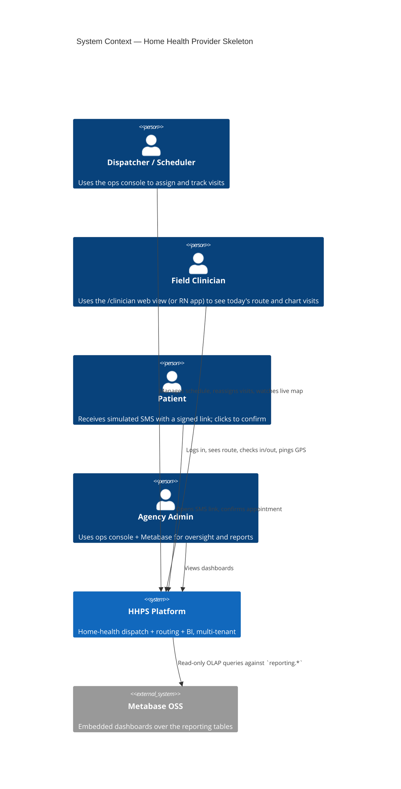
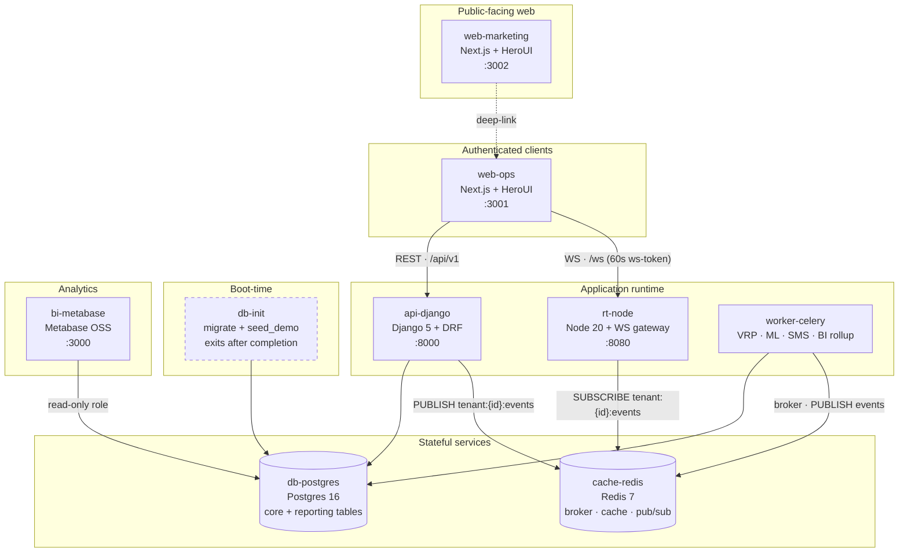
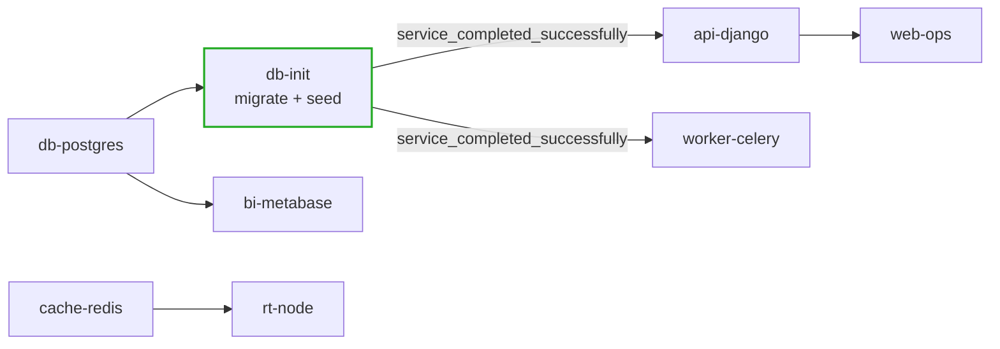
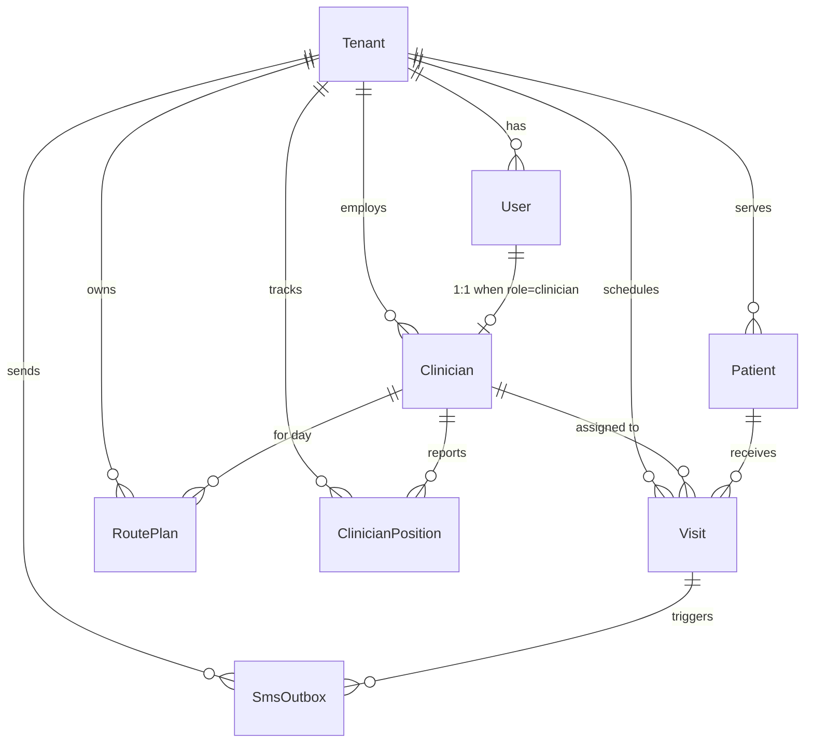
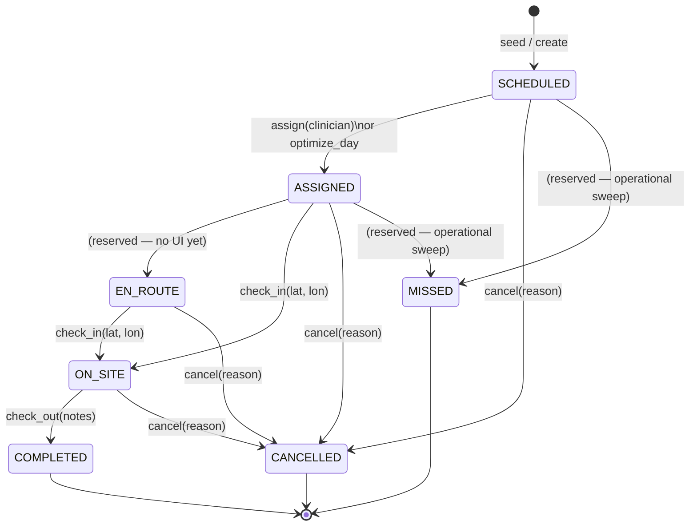
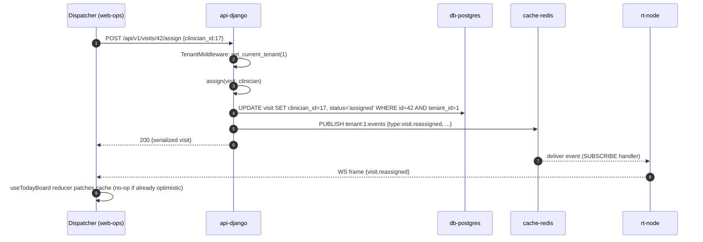
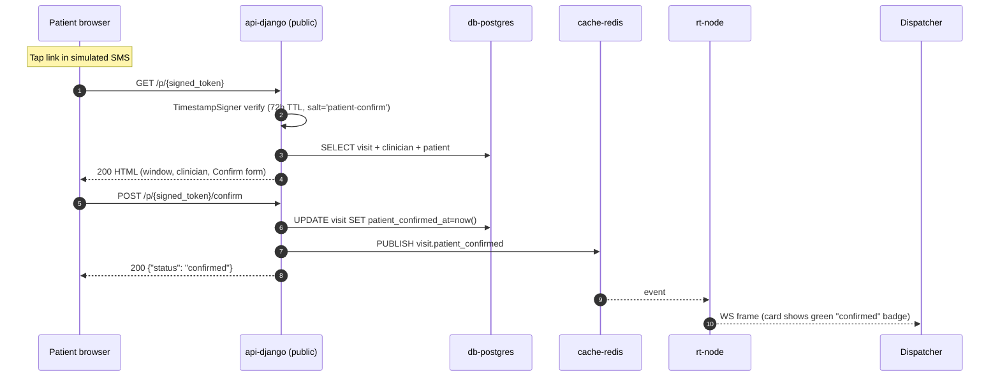

# Home Health Provider Skeleton — Architecture

> **Status:** Living document. Project status: **v1 portfolio-ready (2026-04-25).**
> All nine roadmap phases delivered, 295 tests across four lanes (api / rt-node /
> web-ops / web-marketing), 96%+ coverage on the api and rt-node lanes,
> single `make up` boots the whole stack.
>
> **Subject:** A portfolio-scale clone of a B2B home-health dispatching
> platform, built to actually work end-to-end.
> **Repo:** `home-health-provider-skeleton`

### Phase delivery log

| Phase | Title | Closed | Headline outcome |
|---|---|---|---|
| 1 | Foundations | 2026-04-23 | Bootable compose, JWT auth, tenancy middleware, `seed_demo`. |
| 2 | Core domain | 2026-04-24 | 8 domain models, tenant-scoped REST, Visit state machine. 73 tests. |
| 3 | Routing & ML | 2026-04-24 | OR-Tools VRP adapter + solver, sklearn re-ranker, `optimize_day` Celery task, `POST /schedule/<date>/optimize`. Phase-3 seed scale. 103 tests. |
| 4 | Real-time | 2026-04-24 | `core.events.publish`, tenant Redis channels, ws-token mint, `apps/rt-node/` gateway with heartbeats + auth. 196 tests stackwide, 96%+ coverage. |
| 5 | Ops console | 2026-04-24 | `apps/web-ops/` Next 16 + React 19 + HeroUI 3 + Tailwind 4. JWT login, today board, Optimize Day, click-to-reassign with optimistic mutation + 409 rollback, SVG live ops map, read-only clinicians/patients/sms pages. |
| 6 | Clinician view | 2026-04-24 | `/clinician` route, ordered route view, check-in / check-out optimistic mutations, GPS pinger, `--enable-clinician-login` seed flag. |
| 7 | Marketing site | 2026-04-24 | `apps/web-marketing/` static brand site on `:3002` (hero + features + pricing + contact + deep-link to ops). |
| 8 | BI pipeline | 2026-04-25 | `apps/api/reporting/` app with `DailyClinicianStats` + `DailyAgencyStats`, 15-min on-time grace, `manage.py rollup`, Celery Beat at 02:00, Metabase on `:3000`. |
| 9 | E2E + polish | 2026-04-25 | `ops/full-demo.sh` end-to-end smoke (login → optimize → check-in → GPS, asserts three WS frames); per-action visit permissions; `optimize_day` flips SCHEDULED→ASSIGNED; CI grows rt-node + web-ops + web-marketing lanes; README "Run the demo in five minutes". |

---

## 1. Goal & Scope

**Goal.** Build a working, end-to-end home-health dispatching platform as a
learning / portfolio project. It must run locally and actually function — real
scheduling logic, real event flow, real multi-tenant isolation — without the
weight of production operations (no cloud, no PHI, no real integrations).

**Modeled after.** A B2B SaaS platform for home-health agencies. Our clone
mirrors the *shape* of that product category: a clinician field surface, an
ops/dispatch console, and patient engagement, with an AI-driven routing brain
underneath. Concretely, every piece of the experience the platform's marketing
page promises is delivered in some form — usually the simplest form that still
demonstrates the architecture.

**Non-goals.**

- Not a production system. No HIPAA audit, no SOC 2, no BAA, no real PHI.
- Not an EHR. No clinical documentation depth (OASIS, med-rec, etc.).
- Not a cloud deployment. Local `docker-compose` only.
- Not offline-capable. Online-only on the mobile app.
- Not a real integrations story. SMS, maps, and EMR are all simulated.
- Not a high-availability system. Single Postgres, single Redis, single rt-node.
- Not a multi-region or geo-distributed deployment.

**The portfolio bar.** The project is "done" when a reviewer can clone the
repo, run `make up`, watch a complete dispatcher↔clinician loop fire end-to-end,
and read this document to understand exactly which decisions shaped the
result.

---

## 2. Scoping Decisions

Every decision below was made explicitly during scoping. These are
load-bearing — changes to any of them ripple through the rest of the
document.

| # | Decision | Choice | Rationale |
|---|---|---|---|
| 1 | Build goal | Learning / portfolio — must work end-to-end | Review-friendly, low cost, high signal |
| 2 | Product surface | All three surfaces (clinician app, ops console, patient SMS), shallow but connected end-to-end | Demonstrates the full dispatch loop in one demo |
| 3 | Routing brain | Google OR-Tools VRP solver + ML re-ranker on top | Mirrors the category's technical moat; showcases OR + ML competency |
| 4 | Tenancy | Row-level multi-tenant (`tenant_id` on every domain row, contextvar-scoped manager) | Industry standard B2B SaaS pattern; minimal overhead |
| 5 | SMS / patient engagement | Simulated — messages written to a `sms_outbox` table, rendered in ops console | Zero cost, fully demo-able, no Twilio account needed |
| 6 | Routing / travel-time | Haversine distance + fixed average speed (40 mph) | Cheapest option; known limitation: routes won't follow roads on the map |
| 7 | EMR integration | Mock FHIR-adjacent JSON seed data only — no real FHIR server, no Epic sandbox | Scope control |
| 8 | Real-time layer | Node+TS WebSocket gateway subscribing to Redis pub/sub; Django publishes events | Keeps business logic in Django; Node stays ~500 lines |
| 9 | Auth | JWT + email/password; `role` field on `User` (`clinician`, `scheduler`, `admin`); patients authenticate via signed one-time SMS link | Fastest path that works; no SSO, no RBAC matrix |
| 10 | Offline support | None — online-only | Offline sync is a whole discipline; deferred |
| 11 | BI / analytics | Embedded Metabase pointed at a `reporting` Postgres schema | Industry-standard BI tool; showcases OLTP/OLAP understanding |
| 12 | BI pipeline | Nightly Django management command aggregates OLTP → `reporting` schema | Clean OLTP/OLAP separation without a full dbt/warehouse |
| 13 | Deployment | Local `docker-compose` only, README with demo video | No cloud cost, no infra yak-shaving |
| 14 | Clinical data depth | Operational-only (patient, address, window, skill, status, timestamps, free-text notes) | This is a logistics platform, not an EHR |
| 15 | Seed world size | 2 agencies × 25 clinicians × 300 patients × ~80 visits/day, LA Basin real street addresses | Enough scale for VRP/ML to do real work; small enough to reason about |
| 16 | Web UI kit | **HeroUI 3** (Tailwind-native React component library, NextUI successor) across all web surfaces | Unified look & feel across ops + marketing; modern, accessible, good defaults |
| 17 | Marketing site | Separate Next.js app (`web-marketing`) using HeroUI — hero, features, pricing, contact | Mirrors a typical B2B SaaS brand site; demonstrates brand-facing UI chops |
| 18 | One-command boot | `docker compose up` covers everything | Reviewers should never read a 10-step setup doc |
| 19 | Default demo logins | Seeded admin/scheduler/clinician accounts per tenant, all with `demo1234` password | Instant demo-ability without a registration flow |
| 20 | Seed-on-startup | Dedicated one-shot `db-init` compose service runs migrations + idempotent seed before API starts | Deterministic, reproducible demos from a cold boot |
| 21 | Front-end stack | Next.js 16 (App Router) + React 19 + Tailwind 4 + HeroUI 3 + TanStack Query | Latest stable; HeroUI 3 forced React 19 / Tailwind 4 / Next 15+ |
| 22 | Clinician app form factor | Web-first (shared `web-ops` SPA, `/clinician` route) | Native Expo build deferred to follow-up; the demo loop runs without it |
| 23 | Real-time auth | Short-lived (60 s) `scope='ws'` JWT minted by Django, verified by rt-node | Decouples WS auth lifetime from access-token lifetime; no DB round-trip in rt-node |
| 24 | JWT signing key | sha256-derive when raw key < 32 bytes; mirror that derivation in rt-node | PyJWT raised `InsecureKeyLengthWarning` on the seeded `.env`; both sides must agree |
| 25 | Map | SVG-based ops map (Mapbox skipped) | Mapbox tile cost + key management was friction without payoff |

---

## 3. Stack

| Layer | Technology | Why |
|---|---|---|
| Mobile (clinician) | **Web-first**: shared `web-ops` SPA at `/clinician`. Native Expo SDK 52+ build deferred. | Web-first ships the same demo loop without the native bundler tax |
| Ops web console | **Next.js 16** (App Router) + **React 19** + **TypeScript** + **HeroUI 3** + **Tailwind 4** + **TanStack Query** | Clean SPA; HeroUI brings a consistent, accessible component system across web surfaces; React Query handles cache + optimistic mutations |
| Marketing / landing site | **Next.js 16** + **React 19** + **HeroUI 3** + **Tailwind 4** | Separate app at `:3002` mirroring a B2B SaaS brand site — hero, features, pricing, contact form; "Open the demo" CTA deep-links to the ops console |
| Map on ops console | **SVG**, lat/lon → viewBox transform | Mapbox skipped; SVG demonstrates layout + live updates without a third-party tile dependency |
| Backend API | **Django 5** + **Django REST Framework 3** + **Python 3.12** | Django was user-chosen; DRF is the canonical REST layer |
| Async / background work | **Celery 5** (worker shares Django codebase) + **Redis 7** broker + **Celery Beat** | Hosts VRP solves, ML scoring, nightly BI rollup, simulated SMS side-effects |
| Routing solver | **Google OR-Tools** (Python `ortools`) invoked from a Celery task | Industry default for VRP with time windows + skill constraints |
| ML re-ranker | **scikit-learn** GradientBoostingRegressor, pickled to disk, lazy-loaded in worker | No GPU, no model server; degenerates cleanly to constant 0.5 if pickle missing |
| Real-time gateway | **Node 20 + TypeScript** + `ws` + `ioredis` + `jsonwebtoken` | Thin pub/sub fanout; ~500 LOC; no Express |
| Primary DB | **Postgres 16** (single instance) | Industry default; supports row-level tenancy with ease |
| Cache / queue / pub-sub | **Redis 7** | Celery broker, Django cache, Node WS pub/sub — one component, three roles |
| BI | **Metabase OSS v0.51.7** (Docker image, H2 metadata) | Free, mature, embeddable, good enough dashboards out of the box |
| Orchestration (dev) | **Docker Compose** | Single `docker compose up` to boot the whole stack |
| Python tooling | **uv** (sync, run), **ruff** (lint + format), **mypy** (strict on first-party packages), **pytest** + **pytest-cov** | uv replaces pip/venv; mandatory in this project |
| Front-end tooling | **vitest** + **@testing-library/react** + **jsdom 25**, **@vitest/coverage-v8** | Same harness across web-ops + web-marketing |
| CI | **GitHub Actions** — lint, type, test on PRs, four parallel lanes | Portfolio signal; minimal cost |

---

## 4. Service Topology

All services run under `docker-compose` on a single developer machine.
**`docker compose up` boots the entire platform** — API, worker, real-time
gateway, ops console, marketing site, Metabase, and a one-shot seed step.

### 4.1 System Context (C4 Level 1)



### 4.2 Service Topology (C4 Level 2 / Container)

Every rectangle is a container in `docker-compose.yml`.



### 4.3 Boot Order

`docker compose up` sequences services so downstream ones only start
after their dependencies are ready.



`db-init` declares `depends_on: db-postgres: condition: service_healthy`
and uses Postgres' built-in healthcheck. `api-django` and `worker-celery`
both declare `depends_on: db-init: condition: service_completed_successfully`,
so application services only start after the database is migrated and
seeded.

### 4.4 Port matrix

| Port | Service | Notes |
|---|---|---|
| 3000 | bi-metabase | First-boot wizard; H2 metadata; points at `db-postgres` |
| 3001 | web-ops | `/today` (scheduler/admin) + `/clinician` (clinician) |
| 3002 | web-marketing | Static brand site, deep-links to ops |
| 5432 | db-postgres | OLTP + reporting tables (single schema) |
| 6379 | cache-redis | Celery broker (DB 0) + tenant pub/sub (same DB) |
| 8000 | api-django | DRF + JWT |
| 8080 | rt-node | WebSocket gateway, JWT-auth on `/ws`, `/healthz` HTTP |

---

## 5. Services in Detail

### 5.1 `api-django` — Django 5 + DRF

System of record. Owns authentication, domain models, business logic,
and EMR-shaped seed payloads. Publishes domain events to Redis on every
state change. Single codebase shared with the Celery worker.

**Per-app layout** (`apps/api/<app>/`):

| App | Owns | Key files |
|---|---|---|
| `hhps` | Project root: settings, URL conf, ASGI/WSGI, Celery app | `settings.py`, `urls.py`, `celery.py` |
| `tenancy` | `Tenant` model, `TenantMiddleware`, `TenantScopedManager` | `models.py`, `middleware.py`, `managers.py` |
| `accounts` | `User` (custom AUTH_USER_MODEL), `Role`, JWT login + ws-token mint | `models.py`, `views.py`, `serializers.py` |
| `core` | Cross-cutting infra: `BaseTenantViewSet`, `IsSchedulerOrAdmin`, `events.publish` + schema helpers, `/health` endpoint | `viewsets.py`, `permissions.py`, `events.py`, `urls.py` |
| `clinicians` | `Clinician`, `ClinicianPosition`, `/clinicians/`, `/positions/` | `models.py`, `views.py` |
| `patients` | `Patient`, `/patients/` | `models.py`, `views.py` |
| `visits` | `Visit`, `VisitStatus`, state-machine services, viewset with per-action permissions | `models.py`, `services.py`, `views.py`, `serializers.py` |
| `routing` | `RoutePlan` (per clinician per day) | `models.py` |
| `messaging` | `SmsOutbox`, simulated delivery via Celery, read-only viewset | `models.py`, `tasks.py`, `views.py` |
| `scheduling` | `distance.py` (haversine + travel_seconds), `adapter.py` (build_problem), `vrp.py` (OR-Tools solver), `ranker.py` (sklearn), `tasks.py` (`optimize_day`), `views.py` (`/schedule/<date>/optimize`), `training.py` | All of the above |
| `reporting` | `DailyClinicianStats`, `DailyAgencyStats`, `rollup.py`, Celery Beat task, `manage.py rollup` | `models.py`, `rollup.py`, `tasks.py` |
| `seed` | `seed_demo` management command (idempotent + `--force` + `--enable-clinician-login`) | `management/commands/seed_demo.py` |

**Responsibilities**

- REST API for ops console and clinician view (`/api/v1/...`)
- Authentication: JWT issuance (15-min access, 7-day refresh), short-lived (60 s) WS-auth token minting (`/auth/ws-token`)
- Multi-tenant scoping: `TenantMiddleware` reads `tenant_id` from the JWT claim and stuffs the `Tenant` row into a `ContextVar`; `TenantScopedManager` filters every query through that var, **failing closed** to an empty queryset when the var is unset
- Event publisher: every state change calls `core.events.publish(tenant_id, ...)`, which JSON-encodes a stable envelope `{type, tenant_id, ts, payload}` and `PUBLISH`es it to channel `tenant:{id}:events`. Failures are logged, not raised — events are fire-and-forget
- Per-action permissions on `VisitViewSet`: `_CLINICIAN_ACTIONS = {"list", "retrieve", "check_in", "check_out"}` allow any authenticated tenant member; everything else (assign, create, update, destroy, cancel) is `IsSchedulerOrAdmin`

### 5.2 `worker-celery` — Celery worker

Same image as `api-django`; runs `celery -A hhps worker --loglevel=info`.

| Task | Purpose | Trigger |
|---|---|---|
| `scheduling.ping` | Round-trip sanity (`returns "pong"`) | Manual / health check |
| `scheduling.optimize_day(tenant_id, iso_date, time_budget_s=10)` | Build problem → solve VRP → upsert `RoutePlan` rows → flip SCHEDULED visits to ASSIGNED → publish `schedule.optimized` + per-visit `visit.reassigned` | `POST /api/v1/schedule/<date>/optimize` |
| `messaging.deliver_sms(sms_id)` | Marks queued `SmsOutbox` row as delivered, publishes `sms.delivered` | Triggered after visit transitions (planned) |
| `reporting.rollup_daily(target_date)` | Aggregate `core.*` activity into `reporting.*` | Celery Beat, 02:00 local |

Tests run tasks synchronously via `@override_settings(CELERY_TASK_ALWAYS_EAGER=True)`.

### 5.3 `rt-node` — Node 20 + TypeScript WebSocket gateway

A thin (~500 LOC) fanout layer. **No business logic, no DB access.** All
files in `apps/rt-node/src/`:

| File | Responsibility |
|---|---|
| `server.ts` | `createServer({port, redisUrl, signingKey})` builds an HTTP server with `/healthz` plus a `WebSocketServer` on `/ws`. `attachConnection(ws, subs, signingKey)` runs each socket's lifecycle |
| `auth.ts` | `verifyToken(token, signingKey)` — verifies signature, expiry, and `scope === 'ws'`; returns `{tenantId, role}` or null |
| `signing-key.ts` | `deriveSigningKey(raw)` — sha256-derives when raw < 32 bytes; mirrors Django's `_SIGNING_KEY` derivation so both sides agree |
| `redis.ts` | `SubscriberManager` — lazy `SUBSCRIBE` (refcounted) + last-handler `UNSUBSCRIBE` so the gateway only listens to channels with at least one open client |
| `heartbeat.ts` | Sends `{"type":"ping"}` every 30 s; terminates the socket if no `pong` in 60 s |

**Connection lifecycle.**

1. Client opens `ws://rt-node/ws`.
2. Client sends `{type: "auth", token: "<60s ws-token>"}` as its first frame.
3. Gateway verifies token; on success, sends `{type: "hello", tenant_id: N}`,
   subscribes to `tenant:{N}:events`, and starts heartbeats.
4. Every Redis message on that channel is forwarded raw to the socket.
5. Bad tokens close the socket with code `4401`.
6. On `close`, the gateway stops heartbeats and unsubscribes (last-handler
   semantics so other still-connected clients keep their channel up).

**Deliberately not** a place for any CRUD, scheduling, or ML logic.

### 5.4 `web-ops` — Next.js 16 ops console (HeroUI 3)

The dispatcher's cockpit (and the clinician's web view). Runs on `:3001`.
React 19 + Tailwind 4 (CSS-first `@import`, no JS config) + HeroUI 3 +
TanStack Query.

**Routing.**

```
app/
  layout.tsx                    # root: <Providers> wrapper
  providers.tsx                 # I18nProvider + ToastProvider + QueryClientProvider + AuthProvider
  globals.css                   # Tailwind 4 entry point
  page.tsx                      # marketing-style splash (redirects via auth)
  login/page.tsx                # email + password login
  (authed)/
    layout.tsx                  # role-aware redirect: clinician→/clinician, scheduler/admin→/today
    today/page.tsx              # dispatcher TodayBoard
    clinician/page.tsx          # MyRoute + PositionPinger
    clinicians/page.tsx         # read-only roster
    patients/page.tsx           # read-only patient list
    sms/page.tsx                # SMS outbox log
```

**State management.**

- **Auth.** `contexts/AuthContext.tsx` exposes `useAuth()`. Tokens stored
  via `lib/api.ts:TokenStore`, which writes to `localStorage` and a
  memory mirror so jsdom's broken `removeItem` doesn't crash tests.
- **API client.** `lib/api.ts:apiFetch` automatically retries once on a
  401, refreshing the access token via the refresh endpoint.
- **Server cache.** TanStack Query (`useQuery` + `useMutation`).
- **Realtime.** `hooks/useRealtimeEvents.ts` mints a 60 s ws-token on
  mount, opens a WS to `:8080/ws`, sends the auth frame, and dispatches
  every received message to consumers (`useTodayBoard`, `useMyRoute`,
  `useClinicianPositions`).

**Hooks.**

| Hook | Purpose |
|---|---|
| `useTodayBoard` | `useQuery(['visits'])` + `dispatchTodayBoardEvent` reducer that patches the cache on `visit.reassigned` / `visit.status_changed` / `schedule.optimized` |
| `useReassignVisit` | `useMutation` with optimistic `setQueryData` patch + snapshot rollback on 409; surfaces `ApiError.message` |
| `useMyRoute` | Clinician's own visits in `ordering_seq` order; cache-patch reducer for status changes |
| `useVisitAction` | Generic check-in / check-out mutation |
| `useClinicianPositions` | Latest positions per clinician for the SVG map |
| `useRealtimeEvents` | WS lifecycle + frame dispatch |

**Components.**

| Component | What it does |
|---|---|
| `TodayBoard` | Status filter tabs + Optimize Day button + grid of `<VisitCard>` |
| `VisitCard` | One visit's facts + a "Reassign" button on `status === 'scheduled'` |
| `ReassignModal` | HeroUI 3 modal (`ModalRoot` + `ModalContainer` + `ModalDialog`); lists clinicians filtered by `canServe(credential, required_skill)` |
| `OpsMap` | SVG with lat/lon → viewBox transform; a circle per latest clinician position; pulses on `clinician.position_updated` |
| `MyRoute` | Clinician's ordered route with check-in / check-out buttons |
| `PositionPinger` | `useEffect` that POSTs `/positions/` every 30 s while mounted |
| `SimpleList` | Read-only paginated list (clinicians, patients) |

### 5.5 `web-marketing` — Next.js 16 brand site (HeroUI 3)

Public-facing single-page brand site at `:3002`. No authentication.
Statically prerendered. The page composes Hero, Features, Pricing, and
Contact sections; `ContactForm` is split into its own `'use client'`
island because Next 16's prerender errors on `onSubmit` in a server
component. Deep-links to `:3001` via `NEXT_PUBLIC_APP_URL`.

### 5.6 `db-postgres` — Postgres 16

Single instance, single physical database, **two schemas**: `public`
holds the OLTP `core.*` tables; `reporting` holds the OLAP rollups
(`daily_clinician_stats`, `daily_agency_stats`). The split was added
post-v1 (migration `reporting/0002_schema_separation`) so a dedicated
`metabase_ro` role can be granted SELECT on `reporting` only — write
isolation is now enforced at the *database* layer, not just at the
application layer.

### 5.7 `db-init` — one-shot seed + migrate

A short-lived container built from the same image as `api-django`. On
`docker compose up` it:

1. Waits for Postgres' built-in healthcheck (`pg_isready`).
2. Runs `python manage.py migrate --no-input`.
3. Runs `python manage.py seed_demo --idempotent`.
4. Exits `0`.

`api-django` and `worker-celery` declare
`depends_on: db-init: condition: service_completed_successfully`, so
they only start once seeding completes. `--force` wipes and re-seeds for
clean demos; `--enable-clinician-login` (Phase 6 / Phase 9) sets a
usable password (`demo1234`) on every clinician in every tenant so the
demo loop can exercise any clinician the VRP solver actually assigns.

### 5.8 `cache-redis` — Redis 7

Three roles on one instance, distinguished by usage rather than by DB
index in this build:

- Celery broker / result backend (`redis://cache-redis:6379/0`)
- WebSocket pub/sub fanout (same DB; `PUBLISH`/`SUBSCRIBE` is namespaced
  by channel, not by DB)
- Django cache (configurable; not heavily used in v1)

### 5.9 `bi-metabase` — Metabase

Reads-only against `db-postgres`. H2 metadata DB lives on a named
volume so first-boot config persists across `docker compose down`. The
healthcheck has a 30 s `start_period` because H2 takes ~60 s to
initialize on a cold boot.

---

## 6. Data Model

### 6.1 Core ERD



### 6.2 Field-level detail

**`Tenant`** (`tenancy.models`) — `id`, `name`, `slug`, `timezone`
(IANA, e.g. `America/Los_Angeles`), `home_base_lat`, `home_base_lon`,
`created_at`. Slug is a unique, URL-safe ident used in seeded emails
(`admin@<slug>.demo`).

**`User`** (`accounts.models`) — `email`, `tenant` FK, `role`
(`admin`/`scheduler`/`clinician`), `password_hash` via Django's
default PBKDF2. Unique on `(tenant_id, email)`, **not** globally — so
the same email can exist in two tenants. `auth.E003` is silenced
because of this; the seed picks distinct emails to avoid
`MultipleObjectsReturned` from the default `ModelBackend`. The custom
`UserManager` provides `create_user` / `create_superuser`.

**`Clinician`** (`clinicians.models`) — 1:1 with `User`. Fields:
`credential` (`RN` / `LVN` / `MA` / `phlebotomist`), `skills` JSON
list, `home_lat`, `home_lon`, `shift_windows` JSON list of
`{start, end}`. Used as the VRP "vehicle".

**`ClinicianPosition`** — every GPS ping. Fields: `lat`, `lon`, `ts`,
`heading`, `speed`. Composite index on `(clinician_id, ts DESC)` for
fast latest-position lookup.

**`Patient`** (`patients.models`) — `name`, `phone`, `address`, `lat`,
`lon`, `required_skill`, optional `preferences` JSON.

**`Visit`** (`visits.models`) — the central row. Fields: `patient` FK,
`clinician` FK (nullable, `SET_NULL`), `window_start`, `window_end`,
`required_skill`, `status` (TextChoices), `check_in_at`,
`check_out_at`, `ordering_seq` (position in the clinician's day),
`notes`, `patient_confirmed_at`, `created_at`, `updated_at`. Check
constraint: `window_end > window_start`.

**`RoutePlan`** (`routing.models`) — one row per `(tenant, clinician,
date)`. Fields: `visits_ordered` (JSON list of visit ids in route
order), `solver_metadata` (JSON: `travel_seconds`, `solver_version`).
Upserted by `optimize_day` via `update_or_create`.

**`SmsOutbox`** (`messaging.models`) — `patient` FK, `visit` FK,
`template`, `body`, `status` (`queued|delivered|failed`), `created_at`,
`delivered_at`, `inbound_reply`. Read-only viewset on the API; rows
are written by Celery tasks.

**Reporting tables** (`reporting.models`):

- `DailyClinicianStats` — unique on `(tenant, clinician, date)`.
  Fields: `visits_completed`, `on_time_count`, `late_count`,
  `total_drive_seconds`, `total_on_site_seconds`, `utilization_pct`.
- `DailyAgencyStats` — unique on `(tenant, date)`. Fields:
  `visits_completed`, `visits_missed`, `on_time_pct`, `sms_delivered`,
  `cancellations`.

### 6.3 Tenancy enforcement

Every domain row carries a `tenant` FK. Each model exposes two
managers:

- `objects = models.Manager()` — unscoped; used by admin / seeding /
  auth lookups that legitimately cross tenants (e.g. login by email
  must scan all tenants since email isn't globally unique).
- `scoped = TenantScopedManager()` — filters via the
  `_current_tenant` `ContextVar`; **fails closed** by returning
  `.none()` when no tenant is set.

`tenancy.middleware.TenantMiddleware` runs on every request:

1. Default `request.tenant = None`.
2. Read `Authorization: Bearer ...` header; if present, validate via
   `JWTAuthentication.get_validated_token`.
3. If valid and the token has a `tenant_id` claim, look up the
   `Tenant` row, attach it to `request.tenant`, and `set_current_tenant`
   so `TenantScopedManager` picks it up.
4. After the response, **always** `clear_current_tenant` in a
   `try/finally` so worker threads don't leak tenant context.

`BaseTenantViewSet` uses `Model.scoped.all()` as its queryset and
auto-stamps `tenant=request.tenant` on `perform_create`. Cross-tenant
access returns `404` (the row simply isn't visible), not `403`.

### 6.4 Notable indexes & constraints

| Table | Constraint / Index | Why |
|---|---|---|
| `accounts_user` | `UNIQUE (tenant_id, email)` | Per-tenant email uniqueness |
| `visits_visit` | `CHECK (window_end > window_start)` | Avoid zero/negative windows |
| `clinicians_clinicianposition` | `INDEX (clinician_id, ts DESC)` | Fast "latest position per clinician" lookup for the ops map |
| `routing_routeplan` | `UNIQUE (tenant_id, clinician_id, date)` | Ensures `optimize_day` is idempotent per day |
| `reporting_dailyclinicianstats` | `UNIQUE (tenant_id, clinician_id, date)` | Idempotent rollup |
| `reporting_dailyagencystats` | `UNIQUE (tenant_id, date)` | Idempotent rollup |

---

## 7. Domain events & real-time

### 7.1 Envelope

Every event is published with a stable shape:

```json
{
  "type": "visit.status_changed",
  "tenant_id": 1,
  "ts": "2026-04-25T17:32:11.482Z",
  "payload": { "visit_id": 42, "status": "on_site", "clinician_id": 17 }
}
```

`type` is dotted, present-tense ("happened"). `tenant_id` is duplicated
inside the envelope so consumers can sanity-check. `ts` is UTC ISO 8601
with `Z` suffix (built by `datetime.now(UTC).isoformat().replace('+00:00', 'Z')`).

### 7.2 Catalogue

| Event | Emitted by | Payload | Consumers |
|---|---|---|---|
| `visit.reassigned` | `assign()` in `visits.services`; also per-visit during `optimize_day` | `{visit_id, clinician_id}` | TodayBoard cache patch; (RN app when present) |
| `visit.status_changed` | `check_in()` / `check_out()` / `cancel()` | `{visit_id, status, clinician_id}` | TodayBoard, MyRoute |
| `schedule.optimized` | `optimize_day` Celery task | `{date, routes, unassigned, total_travel_s}` | Optional toast in ops console |
| `sms.delivered` | `messaging.tasks.deliver_sms` | `{sms_id, visit_id, status}` | SMS log page |
| `clinician.position_updated` | `POST /api/v1/positions/` | `{clinician_id, lat, lon, ts}` | OpsMap pin update |
| `visit.patient_confirmed` | `POST /p/<token>/confirm` (public) | `{visit_id, patient_id}` | Today board "confirmed" badge |

All helpers live in `apps/api/core/events.py` (`visit_reassigned`,
`visit_status_changed`, `schedule_optimized`, `sms_delivered`,
`clinician_position_updated`, `visit_patient_confirmed`).

### 7.3 Channel layout

A single channel per tenant: `tenant:{id}:events`. The gateway has no
filtering beyond "are you in this tenant?"; clients filter by `type`.
This is intentional — the volume per tenant is tiny (≤1 frame/s under
normal demo load) so there's no need for finer-grained channels.
**Per-role filtering** is something the rt-node could later do based on
the `role` claim in the ws-token, but isn't required by any current
view.

### 7.4 Failure semantics

- `events.publish` catches `redis.RedisError` and **logs a warning** —
  it never raises. Event publishing is best-effort fanout, not a
  correctness step on the primary write path.
- The rt-node's `SubscriberManager` reference-counts handlers per
  channel; when the last handler unsubscribes, the underlying Redis
  `UNSUBSCRIBE` fires. This means a flapping client doesn't churn the
  Redis subscription list.
- Heartbeats: 30 s ping interval, 60 s missing-pong timeout. Clients
  must respond `{type: "pong"}` to each `{type: "ping"}`. Stale
  sockets are terminated, not left half-open.

---

## 8. Visit state machine



Each transition is a function in `visits/services.py`. They share four
properties:

1. **Guarded.** A wrong starting state raises `ConflictError`, which the
   viewset maps to HTTP 409.
2. **Atomic.** A single `save(update_fields=[...])`.
3. **Stamped.** `check_in_at` / `check_out_at` set via `datetime.now(UTC)`.
4. **Published.** A matching `visit_*` event lands on the tenant
   channel after the save.

`optimize_day` writes status transitions directly via
`Visit.objects.filter(...).update(...)` to bypass the guard during
bulk solver runs (the solver itself only reassigns SCHEDULED rows;
visits that have advanced keep their status):

```python
Visit.objects.filter(id=visit_id, tenant=tenant, status=VisitStatus.SCHEDULED).update(
    clinician_id=route.clinician_id, ordering_seq=seq, status=VisitStatus.ASSIGNED,
)
Visit.objects.filter(id=visit_id, tenant=tenant).exclude(status=VisitStatus.SCHEDULED).update(
    clinician_id=route.clinician_id, ordering_seq=seq,
)
```

---

## 9. Routing & ML brain

### 9.1 The Problem

`scheduling.adapter.build_problem(tenant, target_date)` materializes a
dataclass:

- `clinicians: list[ClinicianNode]` — id, home lat/lon, credential.
- `visits: list[VisitNode]` — id, lat/lon, time-window seconds-since-
  midnight (in tenant timezone), required skill, default 30-min
  service time.
- `distance_matrix: list[list[int]]` — `(num_clinicians + num_visits) ×
  (...)` integer travel seconds. Computed via
  `haversine_km() * 3600 / 40` and rounded.
- `allowed_vehicles: list[list[int]]` — for each visit, the list of
  vehicle indices whose credential satisfies `_can_serve()`.

Credential hierarchy: `RN > LVN > MA`; phlebotomist is standalone
(matched exactly). Code at `scheduling/adapter.py`:

```python
_CRED_RANK = {"MA": 1, "LVN": 2, "RN": 3}

def _can_serve(c, s):
    if c == "phlebotomist" or s == "phlebotomist":
        return c == s
    return _CRED_RANK.get(c, 0) >= _CRED_RANK.get(s, 0)
```

The same rule is mirrored in `apps/web-ops/lib/credentials.ts:canServe`
so the ReassignModal can offer only credentialed clinicians.

### 9.2 The Solver

`scheduling.vrp.solve(problem, time_budget_s=10)`:

- One vehicle per clinician; depot is the clinician's home (start = end
  = vehicle index).
- Single dimension `Time` with slack = max-cumulative = 86 400 s.
- Per-visit time window enforced via `time_dim.CumulVar(index).SetRange(start_s, end_s)`.
- Per-visit disjunction with drop penalty `10_000_000` so the solver
  prefers assigning everyone but can drop the infeasible.
- Vehicle restriction via `routing.VehicleVar(index).SetValues([-1, *allowed])`.
- First-solution: `PATH_CHEAPEST_ARC`; metaheuristic:
  `GUIDED_LOCAL_SEARCH`.
- Returns `Solution(routes, total_travel_s, unassigned_visit_ids)`.

Time budget defaults to 10 s but is configurable per call. The
`optimize_day` Celery task uses 10 s.

### 9.3 The re-ranker

`scheduling.ranker.Ranker`:

- Loads `scheduling/artifacts/ranker.pkl` lazily on first `score()`.
- If missing, returns a constant `0.5` so the solver degenerates
  cleanly to pure travel-time minimization. **Both paths are tested.**
- Features (5): historical on-time % for that clinician, prior visits
  to that patient, credential-rank gap (ordinal), hour-of-day,
  day-of-week. Traffic-bucket deferred.
- Model: `GradientBoostingRegressor` predicting "visit success score"
  in `[0, 1]`.

`scheduling.training.generate_synthetic_history(days, seed)` produces
deterministic training rows; `train_ranker` (a management command) pickles
the artifact.

The score **is wired into the OR-Tools objective** via
`scheduling/rerank.py:build_rerank_costs(problem, ranker, gamma=600)`,
which returns a `[v_idx][c_idx]` matrix of integer "seconds saved"
biases for arcs ending at a visit. When `Problem.rerank_costs` is set,
`solve()` registers per-vehicle arc cost evaluators (via
`SetArcCostEvaluatorOfVehicle`) that subtract the bias from the legacy
`travel + service` cost. The time dimension still uses the pure
travel+service callback so window-feasibility is unaffected by rerank
bias. `optimize_day` only attaches the rerank costs when the pickled
artifact is present (`ranker.is_loaded`); without one, the solver uses
the legacy single-callback path. Disallowed (visit, clinician)
pairings always get a 0 bias regardless of score.

---

## 10. Auth & Authorization

### 10.1 Authentication

- **Login.** `POST /api/v1/auth/login` with `{email, password}` →
  `{access, refresh, user: {id, email, role, tenant_id, clinician_id?}}`.
- **Refresh.** `POST /api/v1/auth/refresh` with `{refresh}`.
- **Token shape.** Standard SimpleJWT plus extra claims: `tenant_id`,
  `role`, `email`. Access = 15 min; refresh = 7 days.

### 10.2 Roles

A single `role` field on `User`: `admin` | `scheduler` | `clinician`.

| Role | Today board | Reassign | Optimize Day | Clinician view | SMS log |
|---|---|---|---|---|---|
| admin | ✓ | ✓ | ✓ | ✓ (read-only) | ✓ |
| scheduler | ✓ | ✓ | ✓ | ✓ (read-only) | ✓ |
| clinician | ✗ | ✗ | ✗ | own only | ✗ |

DRF permission classes: `IsAuthenticated` baseline,
`core.permissions.IsSchedulerOrAdmin` for write actions on visit /
clinician resources. `VisitViewSet.get_permissions` returns
`IsAuthenticated()` for clinician-allowed actions and
`IsSchedulerOrAdmin()` otherwise.

### 10.3 Tenant scoping

See §6.3. The architectural promise: **no view, hook, or service can
see another tenant's row.** Cross-tenant requests `404`. Enforcement is
defense-in-depth — middleware sets the contextvar; manager filters
queries; viewsets stamp `tenant=request.tenant` on create.

### 10.4 WS auth

- `POST /api/v1/auth/ws-token` requires a valid access token.
- Returns a 60 s JWT with `scope='ws'`, `tenant_id`, `role`.
- The rt-node `verifyToken()` checks signature, expiry, and `scope`,
  returns `{tenantId, role}` or null.
- Same signing key on both sides via `_SIGNING_KEY` derivation
  (sha256 if raw < 32 bytes).

### 10.5 Patient auth

Patients authenticate via a signed URL `/p/<token>` rather than via
JWT. Tokens are HMAC-signed by Django's `TimestampSigner` (which uses
`SECRET_KEY` and a per-purpose salt `patient-confirm`) with a 72-hour
TTL. Replay protection is structural: once `Visit.patient_confirmed_at`
is set, the confirm endpoint returns 410 regardless of token freshness.
The two routes (`GET /p/<token>` for the HTML summary and
`POST /p/<token>/confirm` for the action) are mounted in `hhps/urls.py`
outside the `/api/v1/` prefix and bypass DRF entirely — the signed
token *is* the credential.

---

## 11. Background jobs & schedules

| Job | Schedule | Owner | Notes |
|---|---|---|---|
| `scheduling.optimize_day` | On-demand (`POST /schedule/<date>/optimize`) | scheduler/admin | 10-s solver budget; idempotent per (tenant, date) via `update_or_create` |
| `messaging.deliver_sms` | On-demand (queued by request-path) | system | Marks `SmsOutbox` delivered, publishes event |
| `reporting.rollup_daily` | Celery Beat: `crontab(hour=2, minute=0)` | system | Idempotent per (tenant, date); uses 15-min on-time grace |
| `scheduling.ping` | Manual | dev | Health check |

Beat runs in the same `worker-celery` container (single replica). A
real deployment with multiple workers would move Beat to a separate
service or use `celery-redbeat` to avoid double-firing.

---

## 12. Front-end architecture

### 12.1 web-ops in detail

**Stack peer-dep cascade (and why).** HeroUI 3 is the load-bearing
choice. It requires:

- React ≥ 19 → React 19
- Tailwind 4 (CSS-first `@import`, no JS config) → Tailwind 4
- A Next that supports React 19 stable → Next 16

This took several hours to converge during Phase 5: `@heroui/react@2.x`
didn't exist (latest was 3.0.3), so the upgrade rippled through Tailwind
config (deleted `tailwind.config.js`, removed the `@plugin "@heroui/react"`
directive — HeroUI 3 components self-style via tailwind-variants), and
the Next prerender path (server components can't `onSubmit` in Next 16,
so `ContactForm` had to become a `'use client'` island).

**Provider tree.**

```
RootLayout
└─ Providers
   ├─ I18nProvider                (HeroUI 3 locale)
   ├─ ToastProvider               (HeroUI 3 toasts)
   ├─ QueryClientProvider         (TanStack Query, default queryClient)
   └─ AuthProvider                (lib/api TokenStore + login/logout)
      └─ {children}
```

**Optimistic mutation pattern** (`useReassignVisit`):

1. `onMutate({visit_id, clinician_id})`:
   - Cancel queries on `VISITS_KEY` (so an in-flight refetch doesn't
     overwrite our patch).
   - Snapshot `queryClient.getQueryData(VISITS_KEY)`.
   - Optimistically `setQueryData` to flip `clinician` and
     `status: 'assigned'`.
   - Return `{ snapshot }` as the mutation context.
2. `onSuccess(serverPayload)`:
   - Replace the row with the server's authoritative payload.
3. `onError(_, _, { snapshot })`:
   - Restore the cache to `snapshot`.
4. `onSettled` (not used) — the realtime echo (`visit.reassigned`)
   converges with whatever cache state we ended up with; the dispatcher
   reducer handles the same write idempotently.

**SSR posture.** The ops console is effectively a SPA: `(authed)/layout.tsx`
runs on the client, reads the access token, and either redirects to
`/login` or to the role-appropriate page. The marketing site, by
contrast, is statically generated.

### 12.2 web-marketing in detail

A single `app/page.tsx` composing four sections (Hero, Features,
Pricing, Contact). `ContactForm.tsx` is the only `'use client'` file —
it captures form input and writes to a placeholder endpoint for future
inquiries. "Open the demo" button deep-links to `:3001` via
`NEXT_PUBLIC_APP_URL`.

### 12.3 SVG ops map

Mapbox was scoped out (decision #25). The map at
`apps/web-ops/components/OpsMap.tsx` projects lat/lon onto a fixed
viewBox sized for the LA Basin bounding box. Each clinician renders
as a `<circle>` whose `cx`/`cy` come from the projection. On
`clinician.position_updated`, the circle's `cx`/`cy` update via React
state and CSS transitions, producing a glide between positions. The
map is intentionally simple — no street layer, no legend pan/zoom — and
honestly framed as a demonstration of live data flow rather than a
mapping product.

---

## 13. Key Data Flows

### 13.1 Dispatcher manually reassigns a visit



The optimistic mutation in `useReassignVisit` patches the cache on
`onMutate`, the server response replaces it on `onSuccess`, and the
realtime echo lands a short time later with the **same** values —
hence "idempotent reducer".

### 13.2 Dispatcher presses Optimize Day

```mermaid
sequenceDiagram
    autonumber
    participant D as Dispatcher
    participant API as api-django
    participant R as cache-redis (broker+pubsub)
    participant W as worker-celery
    participant ORT as OR-Tools
    participant PG as db-postgres
    participant RT as rt-node

    D->>API: POST /api/v1/schedule/2026-04-25/optimize
    API->>R: enqueue scheduling.optimize_day(tenant=1, 2026-04-25)
    API-->>D: 202 {job_id, status:queued}
    R-->>W: dequeue task
    W->>PG: build_problem (clinicians + open visits)
    W->>ORT: solve(problem, time_budget_s=10)
    ORT-->>W: routes + unassigned
    W->>PG: update_or_create RoutePlan; UPDATE visit clinician+ordering+status
    W->>R: PUBLISH schedule.optimized
    par per assigned visit
        W->>R: PUBLISH visit.reassigned
    end
    R-->>RT: events
    RT-->>D: WS frames; TodayBoard reducer patches each row
```

### 13.3 Clinician checks in at a patient's home

```mermaid
sequenceDiagram
    autonumber
    participant C as Clinician (/clinician)
    participant API as api-django
    participant PG as db-postgres
    participant R as cache-redis
    participant RT as rt-node
    participant D as Dispatcher

    C->>API: POST /api/v1/visits/42/check-in {lat,lon}
    API->>API: VisitViewSet.get_permissions → IsAuthenticated (tenant scope still applies)
    API->>PG: UPDATE visit SET status='on_site', check_in_at=now()
    API->>R: PUBLISH visit.status_changed
    API-->>C: 200 {serialized visit}
    R-->>RT: status_changed
    RT-->>D: WS frame; TodayBoard card flips to on_site
```

### 13.4 Clinician sends a GPS ping

```mermaid
sequenceDiagram
    autonumber
    participant C as PositionPinger (/clinician)
    participant API as api-django
    participant PG as db-postgres
    participant R as cache-redis
    participant RT as rt-node
    participant M as OpsMap (web-ops)

    loop every 30s
        C->>API: POST /api/v1/positions/ {lat, lon, ts}
        API->>PG: INSERT clinicianposition
        API->>R: PUBLISH clinician.position_updated
        R-->>RT: event
        RT-->>M: WS frame; circle glides to new (lat, lon)
    end
```

### 13.5 Patient SMS confirmation (post-v1 #2, shipped 2026-04-27)



`messaging/patient_confirm.py` owns sign/unsign via Django's
`TimestampSigner` (HMAC under `SECRET_KEY`, 72-hour TTL, per-purpose
salt). `messaging/public_views.py` exposes the two endpoints — both
auth-bypassed (the signed token *is* the credential). Replay
protection is structural: once `Visit.patient_confirmed_at` is set,
further POSTs return 410 Gone. Tampered/malformed tokens get 400;
expired tokens get 410.

---

## 14. Security Posture (Portfolio-Appropriate)

This is a portfolio project, not a HIPAA environment. The posture
reflects that.

- **PHI.** Seeded data is synthetic — no real PHI. A `PHI_WARNING.md`
  documents this.
- **Secrets.** All secrets via `.env`; `.env.example` committed, `.env`
  gitignored. The seeded `DJANGO_SECRET_KEY` is short-on-purpose (so
  the sha256-derivation path stays exercised).
- **JWT signing key derivation.** When `DJANGO_SECRET_KEY` is < 32
  bytes, both Django and rt-node `sha256(key).hexdigest()` it.
  Mismatched derivation was a real bug during Phase 4 (the rt-node
  rejected every token); the symmetric `signing-key.ts` module exists
  to keep both sides honest.
- **Transport.** Local dev uses HTTP and `ws://`; production deployment
  (if any) would terminate TLS at a reverse proxy.
- **At-rest encryption.** Not configured. Postgres volume is on-disk
  unencrypted; noted as a known gap.
- **Audit log.** Designed but not wired in v1 (`audit_log` table
  recording `(user_id, tenant_id, action, object_type, object_id, ts)`
  for writes); deferred to a follow-up.
- **Rate limiting.** DRF throttling on patient endpoints when those
  ship.
- **CORS.** Tight allowlist for `:3001` and `:3002` only.
- **Password storage.** Django's default PBKDF2.
- **Demo passwords.** Every seeded user uses `demo1234`. The seed runs
  **only** in local compose; a production deploy must disable the seed
  and rotate.
- **Tenant isolation as defense-in-depth.** Middleware + manager +
  viewset all participate; bypassing one still leaves the others
  filtering. No raw SQL in the request path.

---

## 15. BI / Analytics

- **Tool.** Metabase OSS (Docker image, H2 metadata), on `:3000`.
- **Data source.** Reporting tables live in a dedicated `reporting`
  Postgres schema (post-v1 #3, 2026-04-28). The `metabase_ro` role
  has `USAGE` on the schema and `SELECT` on its tables; it cannot
  read anything in `public` or write anywhere. Connection hints for
  Metabase's first-boot wizard are documented in
  `docker-compose.yml` under `bi-metabase`.
- **Pipeline.** A Celery Beat job (`reporting.rollup_daily`) runs at
  02:00 local time. It reads the previous day's `core.*` activity and
  upserts into `DailyClinicianStats` + `DailyAgencyStats`. Idempotent:
  re-running for the same date replaces existing rows.
- **On-time definition.** `check_in_at <= window_start + 15 minutes`.
- **Rows produced per run.** Roughly `(num_tenants × num_active_clinicians)`
  for clinician stats and `num_tenants` for agency stats.
- **Dashboards (deferred to first-boot config).**
  1. Agency overview (visits/day, on-time %, missed %, SMS delivery %)
  2. Clinician leaderboard (utilization, on-time, visits completed)
  3. Route efficiency trend (VRP objective over time)
  4. Visit volume heat map (hour-of-day × day-of-week)
  5. Skill mix vs demand
  6. SMS engagement funnel
  7. Cancellation / reschedule reasons
  8. Live KPI tiles for the ops console (today-so-far)
- **Provisioning.** Post-v1 #4 added
  `apps/api/reporting/metabase_bootstrap.py` and a `manage.py
  metabase_bootstrap` command that drives Metabase's REST API: admin
  user, read-only DB connection (schema-filtered to `reporting`),
  "Agency overview" dashboard with one daily-stats card, global
  public sharing flipped on, dashboard marked public, public URL
  printed to stdout. Compose service `bi-metabase-bootstrap` runs the
  command once after `bi-metabase` is healthy. Re-runnable: if the
  setup-token has already been consumed, the command logs and exits
  0.
- **Embedding.** The bootstrap script prints the public dashboard
  URL; wiring an iframe under `web-ops` `/reports/<slug>` is the
  remaining sub-task and is tracked separately in
  `docs/plans/2026-04-26-post-v1-followups.md`.

---

## 16. Dev / Demo Infrastructure

### 16.1 Docker Compose

```yaml
services:
  db-postgres      # 5432 · healthcheck pg_isready
  cache-redis      # 6379
  db-init          # one-shot: migrate + seed_demo --idempotent
  api-django       # 8000 · depends_on db-init completed
  worker-celery    # depends_on db-init completed, cache-redis
  rt-node          # 8080 · depends_on cache-redis
  web-ops          # 3001 · depends_on api-django, rt-node
  web-marketing    # 3002
  bi-metabase      # 3000 · depends_on db-postgres
volumes:
  pgdata
  metabasedata
```

A top-level Makefile wraps the common flows:

| Target | Purpose |
|---|---|
| `make up` | `docker compose up -d` + curl-wait for `/api/v1/health` |
| `make down` | `docker compose down` |
| `make reseed` | `db-init` re-run with `seed_demo --force` |
| `make logs` | `docker compose logs -f` |
| `make shell` | `manage.py shell` inside `api-django` |
| `make sync` | `uv sync --extra dev` for the Python lane |
| `make verify` | lint + type + test (api lane) |
| `make verify-node` / `verify-web` / `verify-marketing` | Per-front-end lane |
| `make verify-all` | Runs all four lanes |
| `make cov-all` | Coverage across all lanes |

### 16.2 Seeding

`apps/api/seed/management/commands/seed_demo.py`:

- **Deterministic.** `random.seed(42)` and a curated address list mean
  every seed produces identical tenants, clinicians, patients, and
  histories.
- **Two tenants.** `Westside Home Health` (slug `westside`) and
  `Sunset Hospice` (slug `sunset`).
- **Per tenant.** 25 clinicians (mix of RN / LVN / MA / phlebotomist
  with realistic shift windows and home addresses across the LA
  Basin), 300 patients with geocoded LA-Basin addresses, 90 days of
  historical visits (for the ML training data), 80 visits scheduled
  for "today".
- **Idempotency.** A `seed_marker` row prevents duplicate inserts;
  `--force` drops and recreates. `--enable-clinician-login` enables
  `demo1234` on every clinician (Phase 6 / Phase 9 — originally only
  c00; switched to all so the smoke test can pick whichever clinician
  the VRP solver assigned).
- **Test coverage.** `apps/api/seed/tests/test_clinician_login_flag.py`
  asserts the flag actually flips passwords and that admin auth is
  preserved.

### 16.3 Default demo logins

All seeded accounts use `demo1234`. The login screen shows them in a
"Demo accounts" helper panel.

| Tenant | Role | Email |
|---|---|---|
| Westside Home Health | admin | `admin@westside.demo` |
| Westside Home Health | scheduler | `scheduler@westside.demo` |
| Westside Home Health | clinician (RN) | `c00@westside.demo` (and `c01..c24`) |
| Sunset Hospice | admin | `admin@sunset.demo` |
| Sunset Hospice | scheduler | `scheduler@sunset.demo` |
| Sunset Hospice | clinician | `c00..c24@sunset.demo` |

Clinician accounts only have a usable password when seeded with
`--enable-clinician-login`.

### 16.4 End-to-end smoke

`ops/full-demo.sh` exercises the full Phase 5 + 6 demo loop:

1. Logs in as the admin, gets an access token.
2. Triggers Optimize Day for today.
3. Polls `/visits/` until at least one visit is `assigned` with a
   non-null clinician (up to 30 s).
4. Brute-force-logs in as `c00..c24@<slug>.demo` until it finds the
   account whose `clinician_id` matches the assigned visit's clinician.
5. Mints a scheduler ws-token; opens the rt-node WS via
   `apps/rt-node/scripts/ws-multi-client.mjs` and waits for three frame
   types: `schedule.optimized`, `visit.status_changed`,
   `clinician.position_updated`.
6. Triggers Optimize Day again, posts a check-in, posts a GPS ping.
7. Asserts all three frames landed within `TIMEOUT_MS` (default 25 s).

Exit `0` on full success; non-zero with a diagnostic on any missing
frame. This is the "is the demo working?" canary.

### 16.5 Testing strategy

| Lane | Framework | Tests | Coverage | Notes |
|---|---|---|---|---|
| api | pytest + pytest-django + pytest-cov | 206 | ~96% line | `make cov` enforces ≥ 80% |
| rt-node | vitest + @vitest/coverage-v8 | 37 | ~96% line | `server.ts` direct-run wrapped in `c8 ignore` pragma; smoke test exercises it |
| web-ops | vitest + @testing-library/react + jsdom 25 | 72 | (tracked, not gated) | `useRealtimeEvents` mocked in `MyRoute`/`TodayBoard` tests so it doesn't steal mocked fetches |
| web-marketing | vitest + @testing-library/react | 4 | — | Hero / Pricing / ContactForm |
| **Total** | | **295** | | `make verify-all` |

Notable test patterns:

- **Inline Celery in tests.** `@override_settings(CELERY_TASK_ALWAYS_EAGER=True)` runs tasks synchronously inside the request thread.
- **Tenant context fixtures.** `conftest.py` provides `set_tenant`/`tenant_user` fixtures that wrap calls in `set_current_tenant(...)`.
- **Optimistic-mutation tests.** `useReassignVisit.test.tsx` asserts that a 409 response restores the snapshot and that `ApiError.message` reaches the caller.
- **Permission-shape tests.** Phase 9 added per-action coverage for `VisitViewSet` so a clinician can list/check-in/check-out but cannot reassign.

### 16.6 CI

GitHub Actions, four parallel lanes:

| Lane | Steps |
|---|---|
| api | uv sync · ruff check · ruff format --check · mypy `$(API_APPS)` · pytest (Postgres + Redis services) |
| rt-node | npm ci · `tsc --noEmit` · vitest |
| web-ops | npm ci · `tsc --noEmit` · vitest |
| web-marketing | npm ci · `tsc --noEmit` · vitest |

Local parity: `make verify-all` runs the same gates the CI lanes do
(minus the `npm ci` on already-installed front-ends).

---

## 17. Observability

v1 is intentionally minimal:

- **Logs.** All services log to stdout. `docker compose logs -f` is
  the demo-time observability story. Django logs at INFO; the events
  publisher logs warnings on Redis failures.
- **Healthchecks.** `db-postgres` (`pg_isready`), `bi-metabase`
  (`/api/health`), `rt-node` (`/healthz`), `api-django`
  (`/api/v1/health`).
- **Celery introspection.** No Flower in v1; `make logs` is sufficient
  for the demo. Result backend is wired so `AsyncResult(job_id).status`
  returns useful info when polled (the `POST /schedule/<date>/optimize`
  endpoint returns the job_id for that purpose).
- **Metrics.** None. A real deployment would add OpenTelemetry on the
  Django side and a `/metrics` endpoint on the rt-node, plus Prom +
  Grafana.
- **Error tracking.** None. Sentry would slot in trivially via
  `sentry-sdk[django]`.

---

## 18. Performance & Capacity (back-of-envelope)

**Today's load.** 2 tenants × 25 clinicians × 80 visits/day = 160 visit
rows/day. The dispatcher↔clinician loop fires `≤ 1 frame/s` per tenant
under demo load; the rt-node easily handles single-digit kilohertz.

**Solver.** OR-Tools with 50 visits and 25 vehicles converges well
under the 10-s budget; the demo's solve completes in ~3 s on a laptop.
The solver's complexity is dominated by the local search, so doubling
the world (50 clinicians, 160 visits) would still fit comfortably.

**Postgres.** 14 400 historical visits per tenant × 2 tenants ≈ 28 800
rows in `visits_visit` after seed; trivial.

**Redis.** Pub/sub fanout, no persistent state. A single Redis is
ample.

**Notable bottleneck.** The first `make up` cold-boot is dominated by
(a) Postgres init, (b) the seed (~30 s), (c) Metabase H2 init (~60 s).
Subsequent boots use the volumes and start in ~10 s.

---

## 19. Known Trade-offs & Limitations

| Trade-off | Why accepted | Mitigation |
|---|---|---|
| Haversine routing means straight-line paths on the map | Zero external cost; scope control | Note in README; routes still optimize sensibly on travel time |
| No real SMS | Zero external cost; zero carrier setup | SMS log in ops console is fully demo-able and auditable |
| No real FHIR integration | Scope — interop is a multi-week rabbit hole | Seeded JSON is FHIR-shape-like; upgrade path documented |
| No offline support on mobile | Offline sync is its own engineering discipline | Honest framing in README |
| No full RBAC matrix | Three roles is enough for the demo | Upgrade path: move to a permissions table |
| No cloud deployment | Cost + yak-shaving avoidance | Docker Compose runs anywhere; IaC can be added later |
| Synthetic training data for the ML re-ranker | Can't collect real data | Document the simulation parameters; treat the re-ranker as an architectural demonstration |
| Native Expo build for the clinician app deferred | Web-first ships the same demo loop without the bundler tax | `/clinician` route on `web-ops` is the v1 surface |
| Per-tenant Metabase row-level filtering deferred | Built-in permissions are enough for the demo | Documented |
| Pre-provisioned Metabase dashboards | First-boot wizard is interactive | Could be added via Metabase API + a one-shot sidecar |
| Embedded Metabase iframes inside the ops console deferred | Out of scope for v1 | Reports tab placeholder exists |
| Weak seeded demo passwords | Removes friction for reviewers; zero-config demo | Seed runs only in local compose; a production deploy must disable the seed |
| Recorded demo video / GIFs | Project owner's pass | README has the 5-minute path |

---

## 20. Glossary

- **Agency** / **Tenant** — a home-health organization (e.g.
  "Westside Home Health" in the demo).
- **Visit** — a single scheduled home appointment by one clinician for
  one patient.
- **RoutePlan** — the ordered sequence of a clinician's visits for a
  day, produced by the VRP.
- **Skill / credential** — required licensure for a visit type
  (`RN` for wound care, `LVN` for routine, `MA` for vitals-only,
  `phlebotomist` for draws). Hierarchy: `RN > LVN > MA`; phlebotomist
  is standalone.
- **VRP** — Vehicle Routing Problem. Given a fleet of workers and a
  set of tasks with time windows, produce efficient routes.
- **OR-Tools** — Google's open-source operations-research library.
- **Re-ranker** — ML model used not to assign visits alone, but to
  score candidate assignments inside the optimizer's objective.
- **OLTP / OLAP** — operational (transactional) vs analytical
  (aggregated) data stores. Ours are separated by table, not schema or
  server, in v1.
- **FHIR** — HL7's standard for health data interchange. We mock its
  *shape* in seed data only.
- **TenantScopedManager** — Django model manager that filters every
  query by the current `_current_tenant` ContextVar; fails closed.
- **ws-token** — a 60 s JWT with `scope='ws'` minted by Django for the
  rt-node to verify on a WebSocket connection's first frame.

---

## 21. Open Questions (Deferred)

- Embedded Metabase iframes inside the ops console (`/reports/*`).
- Native Expo build for the clinician app (currently web-first).
- Playwright e2e covering UI flows (the bash smoke covers the
  back-end loop).
- VRP solver fallback policy: greedy nearest-neighbor at timeout vs
  partial-solution return.
- Sentry / OTel wiring.
- Audit log table.

---

## 22. Repository Layout (Appendix)

```
home-health-provider-skeleton/
├── apps/
│   ├── api/                       # Django 5 + DRF (uv-managed)
│   │   ├── hhps/                  # project root: settings, urls, celery, asgi/wsgi
│   │   ├── tenancy/               # Tenant model, middleware, scoped manager
│   │   ├── accounts/              # User, Role, JWT login + ws-token mint
│   │   ├── core/                  # cross-cutting: viewsets, permissions, events, /health
│   │   ├── clinicians/            # Clinician + ClinicianPosition
│   │   ├── patients/              # Patient
│   │   ├── visits/                # Visit, VisitStatus, services (state machine)
│   │   ├── routing/               # RoutePlan
│   │   ├── messaging/             # SmsOutbox + simulated delivery
│   │   ├── scheduling/            # distance, adapter, vrp, ranker, training, tasks, views
│   │   ├── reporting/             # DailyClinicianStats, DailyAgencyStats, rollup, tasks
│   │   ├── seed/                  # seed_demo management command
│   │   ├── conftest.py · pytest.ini · pyproject.toml · uv.lock · Dockerfile
│   ├── rt-node/                   # Node 20 + TS WebSocket gateway
│   │   ├── src/
│   │   │   ├── server.ts · auth.ts · signing-key.ts · redis.ts · heartbeat.ts
│   │   │   └── *.test.ts          # vitest
│   │   └── scripts/ws-multi-client.mjs
│   ├── web-ops/                   # Next 16 + React 19 + HeroUI 3 + Tailwind 4
│   │   ├── app/                   # App Router: (authed)/today, /clinician, /clinicians, /patients, /sms, /login
│   │   ├── components/            # TodayBoard, VisitCard, ReassignModal, OpsMap, MyRoute, PositionPinger, …
│   │   ├── hooks/                 # useTodayBoard, useReassignVisit, useMyRoute, useRealtimeEvents, …
│   │   ├── contexts/              # AuthContext
│   │   ├── lib/                   # api (TokenStore + apiFetch), credentials (canServe)
│   └── web-marketing/             # Next 16 + HeroUI 3 — single-page brand site
├── docs/
│   ├── architecture.md            # this file
│   ├── plans/
│   │   ├── README.md              # phase index (changelog)
│   │   └── history/               # all 9 closed plans (frozen)
│   └── PHI_WARNING.md
├── ops/
│   ├── full-demo.sh               # Phase 9 end-to-end smoke
│   └── ws-smoke.sh                # Phase 4 single-frame smoke
├── docker-compose.yml             # 9 services (one is the one-shot db-init)
├── Makefile                       # up · down · reseed · logs · verify-all · cov-all · …
├── .github/workflows/ci.yml       # 4-lane CI
├── README.md
└── .env.example                   # committed; .env is gitignored
```

---

## 23. v1 Status Snapshot (2026-04-25)

All nine roadmap phases delivered. Compose stack boots end-to-end with
one command; the dispatcher↔clinician loop fires within ~1 s.

### Live ports

| Port | Service | Notes |
|---|---|---|
| 3000 | bi-metabase | First-boot wizard; points at `db-postgres` |
| 3001 | web-ops | `/today` + `/clinician` per role |
| 3002 | web-marketing | Static brand site, deep-links to ops |
| 8000 | api-django | DRF + JWT |
| 8080 | rt-node | WebSocket gateway, JWT-auth on `/ws` |
| 5432 | db-postgres | OLTP + reporting tables |
| 6379 | cache-redis | Celery broker + tenant pub/sub |

### Test + coverage at v1 close

| Lane | Tests | Coverage | Tooling |
|---|---|---|---|
| api (Django) | 206 | ~96% line | pytest + pytest-cov |
| rt-node | 37 | ~96% line | vitest + @vitest/coverage-v8 |
| web-ops | 72 | — | vitest + RTL |
| web-marketing | 4 | — | vitest + RTL |
| **Total** | **319** | | `make verify-all` |

End-to-end demo path covered by `ops/full-demo.sh` (asserts
`schedule.optimized`, `visit.status_changed`, and
`clinician.position_updated` all land on the WS gateway after the
trigger sequence).

### Intentionally deferred (recorded for future-me)

- Native Expo build for the clinician app.
- Playwright e2e suite (replaced by `ops/full-demo.sh`).
- Per-tenant Metabase row-level filtering.
- Embedded Metabase iframes inside the ops console (the bootstrap
  script provisions and prints the public URL; surfacing it in
  `web-ops` is the remaining piece).
- Sentry / OTel wiring; audit log table.
- Recorded demo video / GIFs.

---

*This document will evolve. Any change to the decisions in §2 requires
explicit scope re-approval and an update to all downstream sections.*
